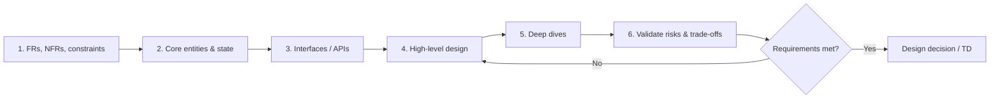
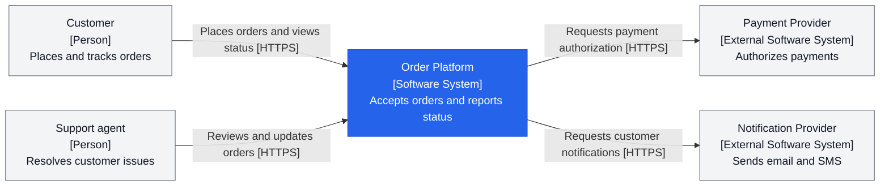
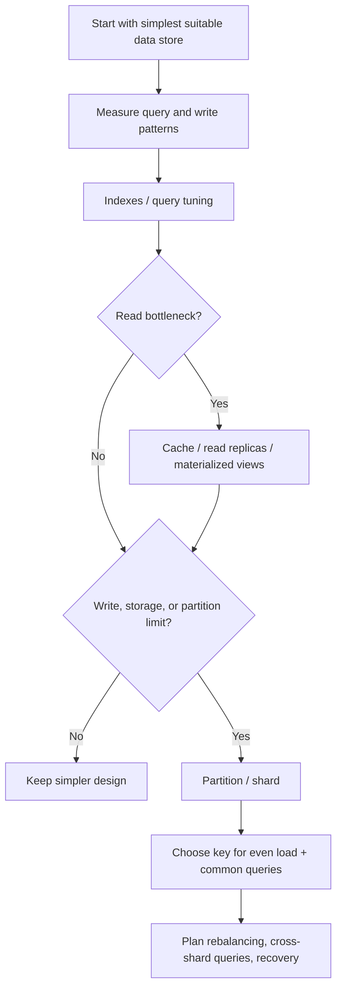
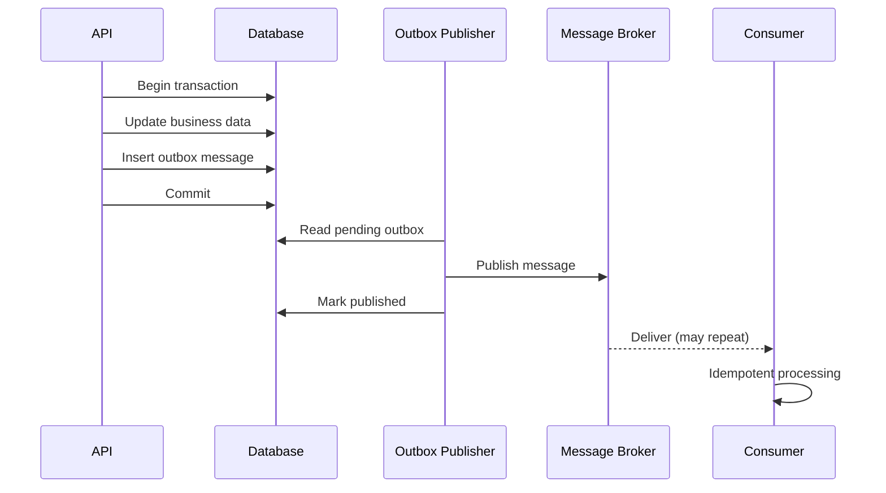
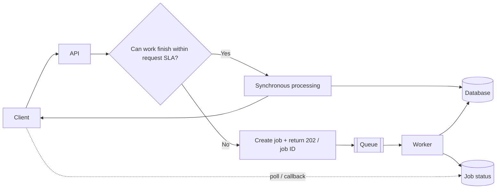
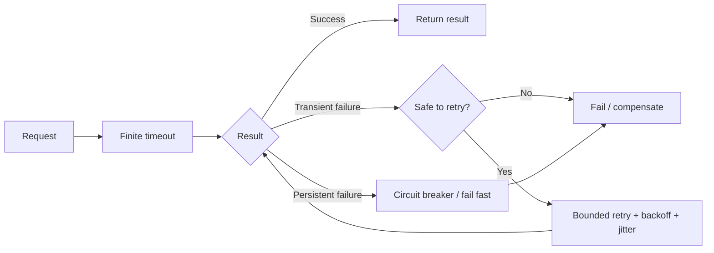
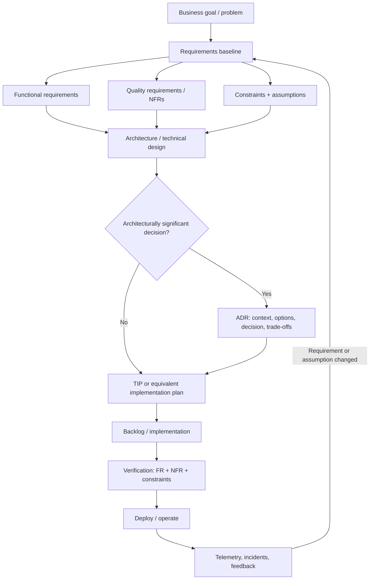
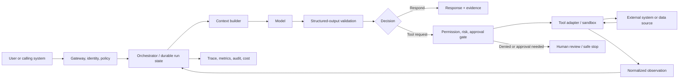

# System Design Checklist Book

> A short, evidence-backed handbook for developers and solution architects

Simple language. Practical questions. No pattern by default.

Canonical edition 5.0 • FR/NFR/constraints lifecycle + ADR/TIP • LLM and agentic systems • Spec-driven development • Mermaid diagrams • Evidence validated 24 August 2026

# Book plan

This book is designed for architecture work, technical design reviews, and implementation reviews. It starts with business requirements, then moves through correctness, distributed-system behavior, security, operations, and safe change. The final chapter combines everything into one review checklist.

| #  | Chapter                                      | Purpose                                                                                                  |
|-----|----------------------------------------------|----------------------------------------------------------------------------------------------------------|
| 1   | Requirements: FRs, NFRs, constraints        | Define required behavior, quality targets, constraints, assumptions, and proof.                         |
| 2   | Boundaries, state & data                     | Know ownership, source of truth, dependencies, and failure boundaries.                                  |
| 2A  | Networking & communication                   | Choose protocols, connection style, geography, and network failure behavior intentionally.              |
| 2B  | Data modeling, indexing & partitioning       | Model from access patterns; optimize before sharding; choose partition keys carefully.                   |
| 2C  | Time, clocks & ordering                      | Make time-zone, expiry, and ordering semantics explicit.                                                 |
| 3   | Concurrency                                  | Protect shared state and reason about simultaneous work.                                                |
| 4   | Transactions & consistency                   | Choose transaction boundaries and the consistency model intentionally.                                  |
| 5   | APIs & idempotency                           | Treat contracts, retries, versioning, rate limits, and duplicate requests as design concerns.            |
| 6   | Messaging & asynchronous work                | Design for duplicate delivery, ordering, backlog, and poison messages.                                  |
| 6A  | Real-time & long-running work                | Choose polling, SSE/WebSockets, or background jobs based on actual interaction needs.                   |
| 7   | Failures & resilience                        | Plan timeouts, retries, circuit breaking, degradation, rate limiting, and recovery.                      |
| 8   | Scale, performance & caching                 | Estimate load, find bottlenecks, bound resources, and control stale data.                               |
| 9   | Security                                     | Define identity, authorization, trust boundaries, secrets, and data protection.                         |
| 10  | Observability & reliability                  | Make behavior measurable with telemetry, SLOs, health, backup, and recovery.                            |
| 11  | Deployment & evolution                       | Change the system without breaking clients, data, or production.                                        |
| 12  | Cost, simplicity & operability               | Avoid architecture that is more expensive or complex than the problem.                                  |
| 13  | Master checklist                             | A reusable end-to-end design review.                                                                     |
| 14  | Requirements-to-delivery lifecycle           | Carry FRs, NFRs, constraints, ADRs, TIP, implementation, verification, and production feedback.          |
| 15  | LLM and agentic systems                      | Design model, context, retrieval, tools, memory, orchestration, safety, evaluation, and operations.       |
| 16  | Spec-driven development for agents           | Turn intent into versioned behavior, tool, context, evaluation, implementation, and release contracts.   |
| 17  | Agent-system review checklist                | Review autonomy, protocols, security, reliability, observability, cost, and human control end to end.     |

## Evidence rule

Technical statements and recommendations in this handbook are tied to standards, official platform guidance, government engineering guidance, or peer-reviewed research. Each section lists source IDs such as [S17]. Practitioner material is clearly separated. Where the book combines several sources into a practical rule, it is a synthesis rather than a quotation. Every resource link at the end was checked twice during this validation pass.

> **Core rule**
>
> Do not start with a pattern or technology. Start with a requirement, failure mode, or constraint. Use the simplest design that satisfies the required behavior and quality level.


## How to use the checklist

Mark each item PASS, RISK, N/A, or DECISION REQUIRED.

For every RISK, record the consequence, owner, and planned mitigation.

For every important ASSUMPTION, record the owner, evidence needed, and when it must be rechecked.

For every architectural pattern, record what concrete problem it solves.

If a requirement cannot be measured or verified, improve the requirement before declaring the design complete.

Review again when traffic, data volume, business criticality, dependencies, or deployment model changes.

*Evidence: S1, S2, S24, S32, S46, S53*

# What we adopted from HelloInterview

HelloInterview is useful as a practitioner-oriented teaching source. It is not used as the primary authority for technical claims in this book. We use its strongest ideas as a structure, then validate the underlying design guidance against standards, official documentation, or research.

| Useful idea                    | Production adaptation in this book                                                                                                                                        |
|--------------------------------|---------------------------------------------------------------------------------------------------------------------------------------------------------------------------|
| Linear delivery framework      | Requirements -> entities/state -> interface -> HLD -> deep dives -> validation.                                                                                      |
| Start simple, then deepen      | Build the smallest coherent design first. Add cache, queue, sharding, distributed coordination, etc. only for a proven requirement or risk.                               |
| Capacity math only when useful | For design discussions, calculate numbers that affect a decision. For production, still perform formal capacity planning and validate with limits, monitoring, and tests. |
| Pattern recognition            | Use patterns as prompts for known problems, not as mandatory ingredients.                                                                                                 |
| Modern limits matter           | Do not memorize stale hardware numbers. Check current service quotas/limits and benchmark the actual workload.                                                            |

*Evidence: S2, S3, S24, S44, P1, P2, P3, P4*

# Practical system-design workflow

Use this sequence for real technical design work. It prevents premature technology choices and keeps the design connected to requirements.


*Figure 1. Design from requirements to a justified technical decision.*



*Evidence: S2, S3, S24, P1*

# The 12-question system design loop

Before going deep, answer these questions in order:

1. What problem are we solving, for whom, and what is explicitly out of scope?

2. What are the FRs, measurable NFRs, fixed constraints, and still-unproven assumptions?

3. What is the source of truth for each important piece of data?

4. What can happen at the same time, and can those operations conflict?

5. Where are the transaction boundaries?

6. Which operations can be retried safely, and how are duplicates handled?

7. Which interactions must be synchronous, and which can be asynchronous?

8. What happens when every dependency is slow, unavailable, or partially successful?

9. What happens at normal load, peak load, forecast growth, and an agreed stress scenario?

10. Who is allowed to do what, and where are the trust boundaries?

11. How will we know the system is healthy and meeting its SLOs?

12. How do we deploy, migrate, roll back, and evolve without breaking users?

*Evidence: S2, S3, S23, S24, S46, S53*

# 1. Requirements: FRs, NFRs, Constraints, and Assumptions

System design starts with a clear business need and a requirement baseline. Functional requirements (FRs) define required behavior. Nonfunctional requirements (NFRs) define measurable quality targets. Constraints define boundaries the design must respect. Assumptions are things we currently believe but still need to validate. Architecture trade-offs only make sense when these are visible.

| Item | Simple meaning | Example |
|---|---|---|
| FR | What behavior must exist? | An authorized user can cancel a pending order. |
| NFR | How well must a critical flow or system perform? | p95 latency <= 500 ms under the agreed load. |
| Constraint | What boundary is fixed for this design? | Data must remain in an approved region. |
| Assumption | What do we believe but still need to prove? | Peak load will stay below 300 requests/s for year one. |
| Acceptance criterion | What observable condition proves a specific behavior or work item? | Cancelled order returns status `Cancelled` and cannot be shipped. |

> **Terminology note**
>
> “NFR” is common software terminology, but standards often speak more precisely about quality requirements and constraints. In this book, NFR means a measurable quality requirement. Fixed mandates and assumptions are tracked separately so they do not disappear inside a vague “NFR” bucket.

*Evidence: S1, S2, S46, S47, S53*

## What good requirements look like

Clear and singular: one requirement should express one understandable need.

Verifiable: define how compliance can be shown by test, analysis, inspection, demonstration, telemetry, or another explicit method.

Traceable: use an ID and link the requirement to its source, design, implementation, and verification evidence.

Feasible and bounded: define relevant load, data, geography, dependencies, limits, and operating conditions.

Owned and prioritized: know who can clarify or change it and how important it is when trade-offs appear.

Assumptions visible: do not baseline a critical assumption as if it were a confirmed fact.

*Evidence: S2, S23, S31, S46, S53*

> **Common failure**
>
> “Highly available, secure, scalable, fast” is not a usable NFR set. It gives no testable target and no basis for trade-offs.

## Checklist

- [ ] Business goal and expected outcome are clear.
- [ ] Functional scope is clear, including what is out of scope.
- [ ] Critical user and business flows are named.
- [ ] Important requirements have stable IDs or another traceable identifier.
- [ ] Requirement source/owner and priority are known.
- [ ] Acceptance criteria or verification method are defined where the requirement needs proof.
- [ ] Expected traffic and peak traffic are estimated.
- [ ] Data volume, growth, retention, and geography are estimated.
- [ ] Latency target is measurable, preferably using percentiles for user-facing paths.
- [ ] Throughput/capacity target is measurable.
- [ ] Availability target is defined for critical flows.
- [ ] RPO and RTO are defined where data loss or downtime matters.
- [ ] Security/compliance requirements are explicit.
- [ ] Cost or budget constraints are explicit.
- [ ] Technology, regulatory, residency, deadline, or organizational constraints are explicit when they are truly fixed.
- [ ] Important assumptions have an owner and a plan to validate or revisit them.
- [ ] Dependencies and third-party limits are known.
- [ ] NFRs are prioritized when they conflict.
- [ ] Each important NFR has a pre-production proof method and, where ongoing compliance matters, a production signal.

*Evidence: S1, S2, S23, S24, S31, S32, S46, S53*

# 2. Boundaries, State, and Data

Most hard architecture problems become easier after you know where state lives and who owns it. Draw the system boundary, external dependencies, trust boundaries, data stores, and the direction of important calls. For each business fact, identify one authoritative source of truth.

*Evidence: S3, S24, S54, S58*

## Key decisions

Stateful vs stateless compute: keep durable state outside replaceable application instances when practical.

Data ownership: in a microservices design, keep service data private to the owning service and expose behavior/data through explicit contracts rather than shared schemas.

Failure domains: identify which failures should be isolated from which other functions.

Dependency direction: know what must be available for a critical request to succeed.

Trust boundaries: every transition across a security boundary needs explicit authentication/authorization assumptions.

*Evidence: S3, S27, S54, S58*

## C4 diagrams: zoom from context to code

The C4 model provides a small set of architecture views at increasing levels of detail. Treat the levels like a map: start wide, then zoom in only where another view helps a specific audience or decision. C4 is notation- and tooling-independent; consistent scope, names, responsibilities, and relationships matter more than shapes or colours.

| Level | Scope | Show | Use it for |
|---|---|---|---|
| 1. System context | One software system and its environment | People, the system in scope, and directly connected external systems | Business and technical alignment on scope, users, and external dependencies |
| 2. Container | One software system | Its applications and data stores, responsibilities, technology choices, and communication | The high-level technical design; in C4, a container is an application or data store, not necessarily a Docker container |
| 3. Component | One container | Major components, responsibilities, interfaces, and dependencies | Explaining a complex container when the extra detail changes understanding or a decision |
| 4. Code | One component | Important classes, interfaces, functions, tables, or other code elements | A difficult implementation area; prefer generating this detail when possible |

Most teams need only system context and container diagrams. Add component or code diagrams when they answer a real question; do not document every level by default. Use separate dynamic diagrams for important runtime interactions and deployment diagrams for environment-specific infrastructure, replicas, and failover.

*A C4-style system context example. Key: blue is the system in scope; grey boxes are people or external systems.*



### C4 diagram checklist

- [ ] The title states the diagram type and scope.
- [ ] One diagram uses one abstraction level; it does not mix systems, containers, components, and code without a clear reason.
- [ ] Every element has a type, meaningful name, and short responsibility description.
- [ ] Containers and components identify their main technology where it helps the audience.
- [ ] Every relationship is directional and labelled with its purpose; container relationships also name the protocol or technology.
- [ ] A legend explains shapes, colours, line styles, acronyms, and any additional notation.
- [ ] Names and relationships remain consistent when zooming between diagrams.
- [ ] The diagram has an owner or generation path and is updated when the architecture changes.

*Evidence: S93*

## Checklist

- [ ] A system context diagram shows people, the system in scope, and directly connected external systems.

- [ ] A container diagram shows the system's applications, data stores, responsibilities, technologies, and communication paths.

- [ ] Each important data set has a clear owner/source of truth.

- [ ] Durable state is not accidentally stored only in one application instance.

- [ ] Session state strategy is explicit.

- [ ] Critical synchronous dependency chains are visible.

- [ ] External dependencies have documented limits and failure behavior.

- [ ] Failure domains are intentional; unrelated features should not fail together without reason.

- [ ] Trust boundaries are marked.

- [ ] Data classification is known for sensitive or regulated data.

- [ ] When using microservices, boundaries follow business capability/responsibility rather than horizontal technical layers.

*Evidence: S3, S24, S27, S54, S58*

# 2A. Networking and Communication

Every remote call crosses a failure boundary. Protocol choice affects latency, connection state, intermediaries, scalability, and failure behavior. Use request/response HTTP when it fits; use server push or bidirectional connections only when the interaction actually needs them.

## Simple protocol choices

HTTP request/response: a common choice when the interaction naturally fits request/response and does not need a persistent two-way channel.

Server-Sent Events (SSE): server-to-client event stream over HTTP when the client mainly receives updates.

WebSocket: persistent two-way channel when both sides need frequent real-time messages.

Async messaging: use when producer and consumer should be decoupled in time or load.

*Evidence: S9, S17, S41, S42*

## Checklist

- [ ] Client-to-service and service-to-service communication paths are visible.

- [ ] Protocol choice is justified by interaction needs, not fashion.

- [ ] Every remote call has a timeout and defined failure behavior.

- [ ] TLS/authentication requirements are defined across trust boundaries.

- [ ] Persistent connections have reconnect, failover, and capacity behavior.

- [ ] Geographic latency and data location are considered where relevant.

- [ ] Payload size and serialization cost are reasonable for the path.

- [ ] Load balancer/gateway behavior is compatible with the selected protocol.

- [ ] DNS/service discovery assumptions are understood for internal services.

*Evidence: S9, S17, S27, S41, S42*

# 2B. Data Modeling, Indexing, and Partitioning

Choose the data model from business invariants and access patterns. First make the simple store work well: model the data, use constraints, create the indexes required by real queries, and measure. Partition or shard only when scale or isolation requirements justify the permanent complexity.

## Practical progression


*Figure 2. Optimize and measure before accepting sharding complexity.*



- [ ] Core entities and relationships are identified before choosing a physical schema.

- [ ] Read/write/query patterns are listed before choosing a data-store model.

- [ ] Transaction and consistency needs are known.

- [ ] Indexes support important query predicates, joins, ordering, or uniqueness.

- [ ] Index write/storage overhead is accepted and monitored.

- [ ] Large binary objects use object/blob storage when that is the better fit.

- [ ] Sharding is justified by a real or forecasted storage/write/concurrency limit.

- [ ] Shard/partition key distributes load and aligns with dominant queries.

- [ ] Hot partitions, cross-shard queries, rebalancing, backup, and recovery are considered.

- [ ] Current service limits and quotas are checked instead of relying on memorized numbers.

*Evidence: S6, S7, S36, S37, S38, S43, S44*

# 2C. Time, Clocks, and Ordering

Time looks simple until a system spans machines, queues, users, and time zones. Treat an instant, a local civil time, an expiry duration, and event ordering as different concepts. UTC is useful for portable instants, but a UTC offset alone does not preserve all time-zone rules. In distributed messaging, timestamps can also be a weaker ordering signal than a broker sequence because clocks can differ.

## Checklist

- [ ] Stored/interchanged instants use an unambiguous representation such as UTC or an offset-aware value.
- [ ] If business meaning depends on local civil time, the relevant time-zone identifier/rules are preserved, not only the current UTC offset.
- [ ] Daylight-saving and time-zone rule changes are considered for schedules and recurring events.
- [ ] Expiry/TTL semantics are explicit: what starts the timer, what happens after expiry, and which clock/source is authoritative.
- [ ] Event ordering requirements are explicit and scoped to the smallest useful key or stream.
- [ ] Wall-clock timestamps are not treated as a universal total order across distributed nodes when correctness depends on ordering.
- [ ] When the broker provides sequence/session semantics, those guarantees are used instead of inventing timestamp ordering.

*Evidence: S56, S57*

# 3. Concurrency

Concurrency means multiple operations can overlap in time. If they read or change shared mutable state, race conditions can produce results that are individually valid but wrong together. Synchronization can protect shared state, but locks introduce contention and can create deadlocks. Prefer designs that reduce shared mutable state before adding more coordination.

*Evidence: S4, S5, S6, S8*

```text
Request A: read stock = 1

Request B: read stock = 1

A: reserve 1

B: reserve 1

Result: two reservations for one item
```


## Common tools

Atomic database update or constraint: often the simplest protection for shared persistent state.

Optimistic concurrency/version check: detect that somebody changed the record before you commit.

Lock/mutex/semaphore: coordinate access when operations truly must be serialized or bounded.

Queue/partition by key: process related work in order without globally serializing all work.

Immutability: reduces the amount of shared mutable state that needs coordination.

*Evidence: S4, S5, S6, S8, S14*

## Checklist

- [ ] We identified operations that can run at the same time.

- [ ] We identified shared mutable state.

- [ ] Business invariants are protected under concurrent writes.

- [ ] Lost-update scenarios are handled.

- [ ] The chosen concurrency mechanism is at the correct layer (application, database, queue, etc.).

- [ ] Lock scope is as small as practical.

- [ ] If multiple locks are used, lock ordering is consistent to reduce deadlock risk.

- [ ] Long I/O is not performed while holding an in-process lock unless justified.

- [ ] Parallelism limits exist for scarce resources.

- [ ] Concurrency behavior is covered by targeted tests where the risk is material.

*Evidence: S4, S5, S7, S8*

# 4. Transactions and Consistency

A transaction gives an atomic boundary for related changes inside a transactional resource. Isolation controls how concurrent transactions interact. Stronger isolation can simplify reasoning, but it can add aborts, retries, blocking, or overhead. Across independently managed services or data stores, one ACID transaction is often unavailable or undesirable, so consistency must be designed explicitly.

*Evidence: S7, S16, S34*

## Practical rules

Keep one business invariant inside one transactional boundary when possible.

Know the database isolation level; do not assume “transaction” means serial execution.

If serialization conflicts are possible, the application must be able to retry the whole transaction safely.

For dual write such as DB + broker, use a reliable pattern such as transactional outbox instead of two unrelated writes.

For multi-service business workflows, decide whether temporary inconsistency is acceptable and how compensation works.

*Evidence: S7, S15, S16*

## Checklist

- [ ] Each business invariant has a clear transactional owner.

- [ ] Transaction boundaries are visible in the design.

- [ ] The required isolation level is chosen intentionally.

- [ ] We know which anomalies are possible at the selected isolation level.

- [ ] Serialization/deadlock retries are safe and bounded.

- [ ] We do not perform an unprotected DB + message dual write.

- [ ] If eventual consistency is used, the user-visible behavior is acceptable and documented.

- [ ] If Saga/compensation is used, every compensable step has a defined compensating action.

- [ ] We know what happens if compensation also fails.

- [ ] Cross-service consistency is not stronger than the business actually needs.

- [ ] If network partitions or multi-region operation matter, the availability-versus-consistency behavior is explicit.

*Evidence: S7, S15, S16, S34*

> **Advanced concepts to recognize**
>
> CAP, consensus, leader election, logical clocks, and distributed locks are important when the problem actually requires them. They are not default ingredients for normal application design.


## Reliable DB + message publishing

If one business operation must update a database and publish a message, two unrelated writes can leave the system inconsistent. A transactional outbox stores the business update and an outbox record in one transaction; a separate publisher later sends the message. Consumers still need duplicate-safe processing.


*Figure 3. Transactional outbox: atomic local write, asynchronous publication, idempotent consumer.*



*Evidence: S12, S15*

# 5. APIs, Contracts, and Idempotency

An API is a contract between independently changing components. HTTP defines important semantics such as safe and idempotent methods. Idempotency matters because clients may not know whether a timed-out operation succeeded, and a retry can otherwise repeat a side effect.

*Evidence: S9, S10, S11*

## Example

```text
POST /payments

Idempotency-Key: order-9381-payment-1


Retry with the same key -> same business effect, not a second charge
```

`Idempotency-Key` here is an example of an API-level contract. RFC 9110 defines idempotent HTTP methods; it does not make an arbitrary POST idempotent just because the client retries it.


## Checklist

- [ ] Resource and operation semantics are clear.

- [ ] HTTP method semantics are used correctly.

- [ ] State-changing operations have an explicit duplicate/retry strategy.

- [ ] Idempotency keys or equivalent protection exist where duplicate side effects are unacceptable.

- [ ] Timeout behavior is defined for clients and downstream calls.

- [ ] Error responses are consistent and actionable.

- [ ] Large collections are paginated.

- [ ] Breaking changes require a versioning/evolution strategy.

- [ ] Backward compatibility is preferred where practical.

- [ ] Rate limits and quotas are defined for constrained resources.

- [ ] Authentication and authorization rules are defined per operation.

- [ ] API telemetry includes correlation/trace context.

*Evidence: S9, S10, S11, S35, S45*

# 6. Messaging and Asynchronous Work

Queues and events can decouple request intake from processing and smooth load, but they change the programming model. At-least-once delivery can produce duplicates, parallel consumers can change ordering, and failed messages can create infinite retry loops or growing backlogs. Design these behaviors before choosing a broker.

*Evidence: S12, S13, S14*

## Checklist

- [ ] The reason for asynchronous processing is explicit: decoupling, load leveling, latency, resilience, or workflow.

- [ ] The required delivery guarantee is understood.

- [ ] Consumers are idempotent when redelivery is possible.

- [ ] Message ordering requirements are explicit and scoped, preferably by business key rather than global order.

- [ ] Poison messages have a dead-letter/quarantine path.

- [ ] Retry count and delay are bounded.

- [ ] Queue depth/backlog is monitored.

- [ ] Producer rate cannot grow indefinitely above safe consumer capacity without a response strategy.

- [ ] Large payload strategy is defined.

- [ ] Schema/version evolution is defined.

- [ ] Correlation IDs link messages to the originating business request.

- [ ] DB + broker publishing uses outbox or another justified reliable mechanism.

- [ ] Replay behavior is safe.

- [ ] Duplicate detection is helpful but does not replace idempotent processing.

*Evidence: S12, S13, S14, S15, S56*

# 6A. Real-Time and Long-Running Work

Do not move work behind a queue only because asynchronous architecture sounds scalable. Keep short work synchronous when it meets the request SLA and simpler failure handling is valuable. For genuinely long work, acknowledge quickly, track status, and process with bounded workers.


*Figure 4. Decide sync vs async from the request SLA and work duration.*



## Checklist

- [ ] The maximum acceptable synchronous request duration is defined.

- [ ] Long-running operations return an explicit job/status contract when needed.

- [ ] Job submission is idempotent when clients may retry.

- [ ] Worker concurrency is bounded by downstream capacity.

- [ ] Job status, failure, retry, timeout, and cancellation semantics are defined.

- [ ] Poison jobs have a quarantine/dead-letter path.

- [ ] Polling, callback/webhook, SSE, or WebSocket is chosen based on actual update needs.

- [ ] Persistent real-time connections have reconnect and fan-out behavior.

*Evidence: S39, S40, S41, S42*

# 7. Failure Handling and Resilience

Remote calls fail differently from local calls: they can be slow, time out, partially succeed, or return after the caller has given up. Resilience is not “retry everything.” Good resilience limits the time and resources spent on failing work and prevents a small dependency problem from becoming a system-wide outage.

*Evidence: S17, S18, S19*

## Failure toolbox

Timeout: stop waiting when useful work can no longer finish in time.

Retry: use only for failures that may be transient and only when the operation is safe to repeat.

Exponential backoff + jitter: spread retries over time and reduce synchronized retry storms.

Circuit breaker: stop calling a persistently failing dependency for a period.

Bulkhead/isolation: keep one dependency or workload from exhausting all shared resources.

Graceful degradation: keep the critical path working when optional functionality fails.

Load shedding/rate limiting: reject work before overload destroys the whole service.

*Evidence: S17, S18, S19, S3, S45*

## Checklist

- [ ] Every remote call has a finite timeout.

- [ ] Retryable and non-retryable errors are distinguished.

- [ ] Retries are bounded.

- [ ] Retries use backoff; jitter is used when many clients can retry together.

- [ ] The operation is idempotent or otherwise protected before automatic retry.

- [ ] Retry behavior is not duplicated at many layers without a retry budget.

- [ ] Persistent failure has a fail-fast/circuit-breaker strategy where useful.

- [ ] Critical resources have concurrency or pool limits.

- [ ] Optional dependencies can degrade without taking down the critical path where business allows.

- [ ] Overload behavior is intentional: throttle, queue, shed, or reject.

- [ ] Failure behavior is tested, not only the success path.

*Evidence: S17, S18, S19, S45*

## Retry decision flow


*Figure 5. Retry only transient failures, only when repetition is safe, and always with bounds.*



*Evidence: S17, S18, S19*

# 8. Scale, Capacity, Performance, and Caching

Scalability is not a promise that “we can add more instances.” You need a load model, known bottlenecks, and safe limits on databases, queues, connection pools, external APIs, and other scarce resources. Caching can reduce latency and load, but it adds staleness and invalidation problems.

*Evidence: S13, S20, S21, S31*

Capacity math should answer a design question: required throughput, storage growth, partition count, connection limits, bandwidth, queue drain time, or cost. For production, confirm the assumptions against current service limits and load tests rather than treating estimates as proof.

*Evidence: S31, S44*

## Checklist

- [ ] Normal, peak, and growth load are estimated.

- [ ] Critical latency and throughput targets are measurable.

- [ ] The slowest/scarcest dependency is identified.

- [ ] Connection/thread/worker pools are bounded.

- [ ] Autoscaling signals match the real bottleneck.

- [ ] Scaling consumers cannot overwhelm the next dependency.

- [ ] Queues are bounded operationally through backlog limits, admission control, or load shedding.

- [ ] Load and stress tests cover realistic data and dependency behavior.

- [ ] Caching solves a measured problem rather than being added by habit.

- [ ] Cache TTL/invalidation rules are explicit.

- [ ] Acceptable staleness is defined.

- [ ] Cache failure behavior is defined.

- [ ] Hot keys/partitions and uneven load are considered.

- [ ] Capacity alerts fire before users experience saturation.

*Evidence: S13, S20, S21, S24, S31*

# 9. Security

Security is part of system design, not a final review step. Zero Trust guidance says network location alone should not create implicit trust. Authentication establishes identity; authorization decides what that identity can do. Least privilege, data protection, secure secret handling, input validation, and security telemetry should be built into the architecture.

*Evidence: S27, S28, S29*

## Checklist

- [ ] Assets and sensitive data are identified and classified.

- [ ] Trust boundaries are shown in the architecture.

- [ ] Authentication method is defined for users, services, and automation.

- [ ] Authorization is enforced at the resource/action level, not only at the UI.

- [ ] Least privilege is applied to identities and service accounts.

- [ ] Secrets are stored outside source code and rotated through a managed process.

- [ ] Encryption in transit is required where appropriate.

- [ ] Encryption at rest meets the data classification/compliance requirement.

- [ ] Inputs are validated at trust boundaries.

- [ ] Network exposure is minimized.

- [ ] Administrative/control-plane access is tightly restricted and auditable.

- [ ] Security-relevant events are logged and monitored.

- [ ] Dependency and patch management are part of the operational design.

- [ ] Threat modeling/security review is planned for material risks.

*Evidence: S27, S28, S29*

# 10. Observability and Reliability

A production system must prove what it is doing. OpenTelemetry defines traces, metrics, and logs as major telemetry signals. SLOs connect these signals to a target level of service reliability. Health checks should distinguish whether a process is alive from whether it is ready to receive traffic.

*Evidence: S22, S23, S26*

## Checklist

- [ ] Critical user journeys have SLIs and SLOs.

- [ ] Availability and latency are measured from a user-relevant point.

- [ ] Logs include enough context to investigate failures without exposing sensitive data.

- [ ] Metrics cover traffic, errors, latency, saturation, and business-critical signals.

- [ ] Distributed traces propagate across service boundaries where useful.

- [ ] Correlation IDs or trace context are consistent.

- [ ] Alerts are actionable and tied to user impact or real operational risk.

- [ ] Readiness and liveness checks have different semantics where the platform supports them.

- [ ] Health checks do not create cascading failure under load.

- [ ] Backup policy is defined for durable data.

- [ ] Restore is tested.

- [ ] RPO/RTO are technically achievable by the selected design.

- [ ] Dependency health and external limits are observable.

- [ ] Dashboards show both current health and capacity trend.

*Evidence: S22, S23, S24, S26*

# 11. Deployment, Migration, and Evolution

A design is incomplete if it only works after a perfect one-time deployment. Production systems change while old and new versions may coexist. API contracts, messages, database schemas, and configuration must evolve safely. Progressive rollout reduces the blast radius of a bad change and creates an explicit decision point before full deployment.

*Evidence: S10, S25, S30, S33, S55*

## Checklist

- [ ] Build and deployment are automated and repeatable.

- [ ] Infrastructure/configuration changes are versioned where practical.

- [ ] The rollout strategy is defined: rolling, canary, blue/green, or another justified method.

- [ ] A rollback or roll-forward strategy exists.

- [ ] Database changes remain compatible during mixed-version deployment.

- [ ] API and message changes are backward compatible where possible.

- [ ] Breaking changes have a migration/deprecation plan.

- [ ] Feature flags are used only where their lifecycle and cleanup are managed.

- [ ] Canary success/failure criteria are measurable.

- [ ] Configuration changes are reviewed and observable.

- [ ] Production smoke/health validation exists after deployment.

- [ ] The release process records what version/configuration is running.

*Evidence: S10, S25, S30, S33, S55*

# 12. Cost, Simplicity, and Operability

Every extra service, database, queue, cache, region, replica, gateway, and framework has a reliability, security, cost, and operational price. Architecture should be as complex as the requirements need, but no more. The Well-Architected guidance explicitly treats architecture as a set of trade-offs rather than independent maximization of every quality.

*Evidence: S2, S3, S30, S32*

## Checklist

- [ ] Every major component has a clear responsibility.

- [ ] Every nontrivial pattern solves a named requirement or risk.

- [ ] We considered a simpler design and documented why it is insufficient if rejected.

- [ ] The team can operate the technology with available skills and support.

- [ ] Ownership is clear for services, data, alerts, and incidents.

- [ ] Runbooks exist for important failure and recovery procedures.

- [ ] Cost model includes normal load, peak load, redundancy, observability, and data transfer where material.

- [ ] High-availability choices match business value; not every component is made mission-critical by default.

- [ ] Operational work is automated where repetition creates risk.

- [ ] Architecture decisions record important trade-offs and revisit triggers.

*Evidence: S2, S30, S32*

> **Practical synthesis**
>
> A good design is not the design with the most patterns. It is the design whose behavior, limits, failures, security, operations, and change process are understood well enough to justify the trade-offs.


# 13. Master System Design Review Checklist

Use this section before Technical Design approval, Architecture Review, or implementation sign-off. Items marked “if relevant” are not mandatory for every system.

## 13.1 Scope and requirements

- [ ] Problem, users, scope, and out-of-scope are clear.

- [ ] Fixed constraints and important assumptions are explicit.

- [ ] Critical flows are named.

- [ ] Traffic, peak, data volume, and growth assumptions are recorded.

- [ ] Availability, latency, throughput, RPO, and RTO are measurable where relevant.

- [ ] Security/compliance requirements are explicit.

- [ ] Cost and delivery constraints are explicit.

## 13.2 Architecture and boundaries

- [ ] Context/container diagrams are current.

- [ ] Service responsibilities and ownership are clear.

- [ ] Source of truth is known for important data.

- [ ] Trust boundaries are shown.

- [ ] Critical dependency chains are known.

- [ ] Failure domains are intentional.

## 13.3 Data and concurrency

- [ ] Business invariants are identified.

- [ ] Concurrent update scenarios are handled.

- [ ] Lost updates are prevented.

- [ ] Time-zone, expiry, and business-ordering semantics are explicit where relevant.

- [ ] Transaction boundaries are clear.

- [ ] Isolation level and relevant anomalies are understood.

- [ ] Locks/version checks/constraints are justified and scoped.

- [ ] Core access patterns are known and the selected data model fits them.

- [ ] Indexes are designed for critical queries and their write/storage cost is understood.

- [ ] Sharding/partitioning is used only for a concrete scale/isolation reason.

- [ ] Partition key avoids hotspots and supports dominant access patterns.

## 13.4 Distributed consistency

- [ ] Cross-service consistency requirements are explicit.

- [ ] DB + message dual writes are protected.

- [ ] Eventual consistency is acceptable to the business where used.

- [ ] Saga/compensation exists only where a multi-step distributed workflow needs it.

- [ ] Retry of aborted transactions is safe.

- [ ] Partition/multi-region behavior states what becomes unavailable, stale, or rejected when coordination is lost.

## 13.5 APIs

- [ ] API contract is clear and consistent.

- [ ] Idempotency/retry behavior is explicit.

- [ ] Pagination exists for potentially large collections.

- [ ] Timeout and error semantics are defined.

- [ ] Versioning/backward compatibility strategy exists.

- [ ] Authentication, authorization, rate limits, and telemetry are defined.

- [ ] Protocol/connection style is justified: request-response, polling, SSE, WebSocket, or other.

- [ ] Persistent connection reconnect/failover behavior is defined where relevant.

## 13.6 Messaging (if relevant)

- [ ] Reason for async communication is explicit.

- [ ] Delivery semantics are understood.

- [ ] Consumers are idempotent.

- [ ] Ordering requirement is explicit.

- [ ] DLQ/poison-message handling exists.

- [ ] Retry/backlog/replay behavior is bounded and observable.

- [ ] Message schema evolution is defined.

- [ ] Long-running jobs have status, cancellation, timeout, and worker-capacity rules.

- [ ] Async processing is used because it solves a concrete duration/load/decoupling problem.

## 13.7 Failure and overload

- [ ] Every remote call has a finite timeout.

- [ ] Retries are selective, bounded, and use backoff.

- [ ] Retry storms are prevented.

- [ ] Circuit breaker/fail-fast is used where persistent failures would cause damage.

- [ ] Pools/concurrency are bounded.

- [ ] Overload strategy exists: throttle, queue, shed, or reject.

- [ ] Optional features degrade without breaking critical paths where possible.

## 13.8 Scale and performance

- [ ] Load model exists.

- [ ] Bottlenecks and quotas are known.

- [ ] Autoscaling uses meaningful signals.

- [ ] Downstream capacity remains safe when upstream scales.

- [ ] Cache strategy includes invalidation/TTL and staleness.

- [ ] Load/stress testing is planned or completed.

- [ ] Capacity estimates are tied to architectural decisions and checked against current service limits.

- [ ] Hot partitions/keys and cross-partition operations are considered.

## 13.9 Security

- [ ] Identity and access model is explicit.

- [ ] Least privilege is applied.

- [ ] Secrets management and rotation are defined.

- [ ] Data in transit/at rest protection meets requirements.

- [ ] Input validation exists at trust boundaries.

- [ ] Security events are observable.

- [ ] Threat/security review matches system risk.

## 13.10 Reliability and observability

- [ ] SLIs/SLOs exist for critical flows.

- [ ] Logs, metrics, and traces support diagnosis.

- [ ] Alerting is actionable.

- [ ] Health/readiness semantics are correct.

- [ ] Backup/restore are defined and tested where needed.

- [ ] Recovery design can meet RPO/RTO.

## 13.11 Deployment and change

- [ ] CI/CD path is repeatable.

- [ ] Rollout and rollback/roll-forward strategy exist.

- [ ] DB/API/message changes work during mixed-version deployment.

- [ ] Destructive schema changes are sequenced only after old application versions no longer depend on the old schema.

- [ ] Canary/progressive deployment has measurable gates where appropriate.

- [ ] Configuration and infrastructure are controlled and observable.

## 13.12 Cost and operations

- [ ] Architecture complexity is justified.

- [ ] Team can operate the selected technologies.

- [ ] Ownership and escalation are clear.

- [ ] Operational runbooks exist for critical failure modes.

- [ ] Cost model includes resilience and observability overhead.

- [ ] Trade-offs and revisit triggers are recorded.

## 13.13 Requirements, ADRs, and implementation plan

- [ ] FRs are traceable to acceptance criteria, design, implementation, and tests.

- [ ] Critical NFRs have measurable targets, conditions, verification methods, and production signals.

- [ ] Architecturally significant decisions are captured in ADRs with alternatives and trade-offs.

- [ ] Accepted ADRs are preserved; changed decisions are superseded rather than silently rewritten.

- [ ] A TIP or equivalent implementation plan translates the approved design into ordered implementation, migration, testing, observability, and rollout work.

- [ ] Production evidence feeds back into requirements, ADR assumptions, and future design work.

*Evidence: S46, S47, S48, S49, S50, S52, S53*

*Evidence: S2, S24, S29, S30, S31, S32, S45, S53, S55, S56, S57*

# 14. Requirements-to-Delivery Lifecycle: FR, NFR, Constraints, ADR, and TIP

Requirements are not finished when they are written. They stay traceable through design, decisions, implementation, verification, deployment, and operation. ISO/IEC/IEEE 29148 treats requirements engineering as a life-cycle activity. NASA guidance adds explicit requirement quality, traceability, and verification practices. Microsoft guidance connects business requirements, architecture specifications, engineering work items, testing, and ongoing operation.

*Evidence: S46, S47, S49, S50, S53*

## 14.1 The full cycle

*Requirements-to-delivery lifecycle.*



The key idea is bidirectional traceability: requirements point forward to design and proof, while implementation and decisions point backward to the requirement, constraint, assumption, or risk that justified them.

*Evidence: S46, S47, S49, S50, S53*

## 14.2 Functional requirements (FR) — full cycle

FRs describe required behavior for a user, business process, or another system. They should be clear enough to design, implement, and verify. A user-story sentence can be useful for planning, but it is not a substitute for important business rules, data rules, error behavior, or integration semantics when those details affect correctness.

Discover: identify the business outcome, actors, triggers, rules, data, dependencies, and unhappy paths.

Clarify: remove ambiguity and separate assumptions from confirmed requirements.

Specify: give important requirements a stable identifier and define observable acceptance/verification conditions.

Validate: review correctness, completeness, consistency, feasibility, and ambiguity with relevant stakeholders.

Design: map the FR to components, APIs, data, workflows, and any architecturally significant decisions.

Implement: create traceable work items and keep deviations visible rather than silently drifting from the approved design.

Verify: prove the requirement by test, analysis, inspection, demonstration, or another appropriate method.

Release and observe: confirm the real user flow works and use incidents/feedback to refine future requirements.

> **FR vs acceptance criteria**
>
> An FR states required system behavior. Acceptance criteria are concrete conditions used to prove a story, feature, or requirement. They are related, but they are not the same artifact.

*Evidence: S46, S47, S49, S50, S53*

### FR minimum checklist

- [ ] Business outcome and user/system actor are clear.
- [ ] Requirement has a stable ID or traceable work-item identity.
- [ ] Source/owner and rationale are known for important requirements.
- [ ] Trigger, normal flow, error flow, and important business rules are clear.
- [ ] Inputs, outputs, data ownership, and external dependencies are known.
- [ ] Acceptance criteria or verification method are observable and testable.
- [ ] Out-of-scope behavior is explicit when ambiguity is likely.
- [ ] The requirement has priority/change authority.
- [ ] Assumptions are explicit and confirmed before they become part of the baseline.
- [ ] The design and work items link back to the FR.
- [ ] Verification evidence links back to the FR or its acceptance criteria.
- [ ] Any implementation deviation is reviewed and reflected in the requirement/design/ADR as appropriate.

## 14.3 Nonfunctional requirements (NFR) — full cycle

In this book, NFR means a measurable quality requirement: how well a named system or critical flow must operate. Examples include availability, latency, throughput, recovery, security, scalability, privacy, and operability. Cost can also be a measurable design target. Fixed mandates are tracked as constraints rather than hidden inside the NFR list.

*Evidence: S1, S2, S23, S31, S46, S51, S53*

> **A practical NFR format**
>
> For <critical flow>, measure <metric> at <measurement point>. Target <threshold> under <load/conditions> during <observation window>. Verify with <test method> and monitor with <production signal>.

Example: “For the checkout API, p95 server latency must stay below 500 ms at 100 requests/second for 15 minutes, with an error rate below 1%. Verify in a load test and monitor the same signals in production.”

Discover: identify which quality attributes matter for each critical user/system flow.

Quantify: add metric, target, load/conditions, measurement point, and time window.

Prioritize: decide which NFRs are hard targets and which can be traded against cost, complexity, or time.

Design: use NFRs to drive capacity, resilience, security, data, deployment, and observability decisions.

Record decisions: create ADRs when meeting an NFR requires a significant or difficult-to-reverse architectural choice.

Plan verification: define load, resilience, security, recovery, or operational tests before implementation is considered done.

Observe: map ongoing NFRs to production telemetry, SLIs/SLOs, alerts, or periodic exercises.

Revisit: if real traffic, business criticality, incidents, or cost assumptions change, review both the NFR and the design.

*Evidence: S2, S23, S31, S47, S50, S51, S53*

### NFR minimum checklist

- [ ] NFR applies to a named system or flow, not vaguely to everything.
- [ ] Metric is defined.
- [ ] Target/threshold is defined.
- [ ] Load, failure, geography, data volume, or other relevant conditions are defined.
- [ ] Measurement point and observation window are defined.
- [ ] Trade-off priority is understood.
- [ ] Architecture choices that exist mainly to satisfy the NFR are traceable.
- [ ] A pre-production verification method exists.
- [ ] A production signal exists where ongoing compliance matters.
- [ ] The NFR is reviewed when assumptions or criticality change.

## 14.4 Constraints and assumptions

Constraints are boundaries the design must respect, such as a mandated platform, legal/data-residency rule, fixed integration protocol, budget ceiling, or delivery deadline. Assumptions are unproven statements used to move the design forward. They are useful, but dangerous when they silently become “facts.”

### Constraint and assumption checklist

- [ ] Each important constraint has a source/owner and is truly fixed rather than a preference.
- [ ] Conflicting constraints are escalated instead of hidden in the design.
- [ ] Each important assumption states what evidence would confirm or reject it.
- [ ] Assumptions have an owner and a revisit trigger/date when the risk is material.
- [ ] Architecture decisions identify which assumptions they depend on.
- [ ] A disproved assumption triggers requirement/design/ADR review rather than silent implementation drift.

*Evidence: S46, S47, S48, S53*

## 14.5 Traceability — keep the chain visible

| Artifact | Main question | Should link to |
|---|---|---|
| Business goal | Why are we doing this? | Outcome / KPI / stakeholder |
| FR | What must the system do? | Source, acceptance/verification, design, tests |
| NFR | How well must it do it? | Metric/target, design, tests, telemetry |
| Constraint | What boundary must the design respect? | Source/authority, affected decisions |
| Assumption | What are we treating as true for now? | Owner, evidence, revisit trigger, affected decisions |
| Architecture / TD | How should the system be shaped? | FRs, NFRs, constraints, diagrams, ADRs |
| ADR | Why did we choose this significant option? | Requirement/risk, alternatives, trade-offs, superseding ADR |
| TIP / technical spec | How will we implement the approved design safely? | Design/ADRs, work items, rollout, rollback/roll-forward, tests |
| Verification evidence | How do we prove it? | FR/acceptance criteria and NFR targets |
| Telemetry / SLO | Does it still work as required in production? | NFR/critical flow and operational owner |

*Evidence: S46, S47, S49, S50, S53*

## 14.6 ADRs — use them for decisions, not for everything

An ADR records an architecturally significant decision and why it was made. Microsoft recommends ADRs for choices that affect system structure, key quality attributes, or are difficult to reverse. An ADR should contain context, options, the decision, important trade-offs, confidence/assumptions, and status. Keep accepted ADRs as history; when a decision changes, create a new ADR that supersedes the old one instead of rewriting the past.

*Evidence: S48, S52*

### Create an ADR when…

- [ ] The choice changes system boundaries, data ownership, integration style, deployment topology, or a major technology.
- [ ] The choice exists mainly to satisfy an important NFR such as availability, consistency, security, recovery, or scale.
- [ ] The decision has meaningful trade-offs or rejected alternatives that future engineers need to understand.
- [ ] The decision is expensive, risky, cross-team, or difficult to reverse.
- [ ] A previous accepted architecture decision must change.

### ADR lifecycle

Proposed: context, requirements, options, trade-offs, assumptions, and recommendation are written.

Reviewed: relevant stakeholders challenge assumptions and consequences.

Accepted: decision becomes the current architectural direction.

Linked implementation/validation evidence: work items, TIP/technical specification, tests, and production evidence show whether the assumptions held. This does not have to be a formal ADR status.

Superseded: a new ADR replaces the old decision while preserving history and links.

> **Do not turn an ADR into a design document**
>
> The ADR explains the significant choice and rationale. Detailed diagrams and implementation steps belong in the architecture/technical design and TIP or technical specification. Link them instead of duplicating them.

## 14.7 TIP — Technical Implementation Plan

> **Terminology note**
>
> “TIP” is not a universal industry-standard acronym. In this book, TIP means Technical Implementation Plan: the implementation-ready plan that translates approved requirements, design, and ADRs into a safe sequence of engineering work. Other teams might call the same artifact a technical specification, implementation plan, engineering plan, or detailed technical design. Microsoft uses the closely related term “technical specification” for the engineering plan-of-record.

*Evidence: S47, S49*

A TIP should be detailed enough that developers, QA, DevOps, security, and operations can understand what changes, in what order, how it is verified, and how it is released or reversed. It should not silently reopen settled architecture decisions. If implementation exposes a broken assumption or requires a new architecturally significant decision, review/supersede the ADR and then align the TIP.

### TIP minimum contents

- [ ] Scope and links to FRs, NFRs, constraints, architecture/TD, and relevant ADRs.
- [ ] Assumptions, prerequisites, dependencies, and known constraints.
- [ ] Impacted components, APIs/contracts, data stores, infrastructure, and configuration.
- [ ] Implementation sequence and dependencies between work items.
- [ ] Database/schema migration, data backfill, compatibility, and cleanup steps where relevant.
- [ ] Security/identity/network changes and required permissions where relevant.
- [ ] Feature flags or compatibility strategy for mixed old/new versions where relevant.
- [ ] Test plan: unit, integration, contract, E2E, performance, resilience, security, and recovery tests as required by risk/NFRs.
- [ ] Observability changes: logs, metrics, traces, alerts, dashboards, and health checks.
- [ ] Deployment/rollout plan, success gates, rollback or roll-forward path.
- [ ] Operational/runbook changes and ownership.
- [ ] Risks, open questions, decisions still needed, and explicit N/A items.

*Evidence: S47, S49, S55*

### TIP lifecycle

Draft after the design is stable enough to implement.

Review with the people who will build, test, deploy, secure, and operate the change.

Break the TIP into traceable work items without losing the end-to-end sequence.

Update implementation detail when reality changes; do not silently change architecture intent.

If implementation requires a new significant architecture choice, create/supersede the ADR and then align the TIP.

Before release, verify that all planned FR/NFR checks, constraint checks, and operational prerequisites are complete.

After release, compare production evidence with the assumptions and NFR targets.

*Evidence: S47, S49, S50, S55*

### TIP — short template

| Section | What to write |
|---|---|
| Goal / scope | What change are we delivering and what is explicitly out of scope? |
| Traceability | FR/NFR/constraint IDs, TD/design links, ADR IDs, main work item. |
| Current → target | What exists now and what will be true after implementation? |
| Impacted areas | Services, APIs, schemas, data, infrastructure, identity, config, UI. |
| Steps | Ordered implementation/migration sequence with dependencies. |
| Compatibility | How old/new versions and data coexist during rollout. |
| Tests / proof | How each important FR, NFR, and constraint will be verified. |
| Observability | Signals and alerts needed to validate production behavior. |
| Release | Deployment strategy, gates, feature flags, rollback/roll-forward. |
| Risks / assumptions | What can invalidate the plan, how will it be checked, and who owns it? |
| Done | Conditions required before the change is considered complete. |

## 14.8 Full-cycle review checklist

- [ ] Business goal → FRs/NFRs/constraints are traceable.
- [ ] FRs have observable acceptance or verification conditions.
- [ ] Critical flows have measurable NFRs.
- [ ] NFRs state metric, target, conditions, measurement point/window, and verification method.
- [ ] Important assumptions have owners and evidence/revisit plans.
- [ ] Architecture/TD demonstrates how FRs, NFRs, and constraints are satisfied.
- [ ] Significant decisions have ADRs with alternatives and trade-offs.
- [ ] Accepted ADRs are preserved; changed decisions supersede them.
- [ ] TIP or equivalent technical specification translates approved design into an ordered implementation, test, migration, and rollout plan.
- [ ] Work items and code changes can be traced back to the plan/requirements.
- [ ] Tests and other verification evidence prove the FRs and relevant NFRs.
- [ ] Production telemetry proves or challenges key NFRs and assumptions.
- [ ] Incidents, usage changes, and business changes feed back into requirements and architecture.

*Evidence: S46, S47, S48, S49, S50, S52, S53, S55*

# 15. LLM and Agentic Systems

An LLM application produces model output. An agentic system additionally lets a model select steps, use tools, observe results, and continue until a goal or stopping condition is reached. A workflow fixes most of that control flow in code; an agent chooses more of it at runtime. The boundary is a design decision, not a product label.

This chapter is a current engineering snapshot, not a promise that every model, framework, or protocol will remain unchanged. Provider features and emerging agent protocols move quickly; keep their versions and assumptions explicit.

*Evidence: S61, S62, S63, S64, S65*

## 15.1 Start with the least autonomy that works

Use the lowest level that satisfies the requirement:

1. **Deterministic function:** rules and ordinary code fully define the result.
2. **Single model call:** one bounded inference, preferably with a structured output contract.
3. **Deterministic workflow with model steps:** code owns routing, retries, limits, and completion.
4. **Single agent:** the model chooses among approved tools inside a bounded loop.
5. **Multi-agent system:** specialized agents coordinate or delegate because the work is genuinely separable.

Move upward only when evaluation shows a material quality or coverage gain. Every increase in autonomy also increases the space of possible trajectories, tool calls, cost, latency, and failure modes. Multi-agent designs are most useful for independent, parallelizable work; shared mutable state and tightly coupled steps often make them slower and harder to debug.

*Evidence: S63, S65, S69*

## 15.2 Define the agent contract before choosing a framework

For each agent, write down:

- Goal and user value.
- Non-goals and prohibited outcomes.
- Inputs, output schema, and evidence/citation expectations.
- Allowed data sources and their trust level.
- Allowed tools, permissions, and side effects.
- Autonomy boundary: what it may decide, propose, or execute.
- Human approval points and who can approve.
- Time, token, tool-call, recursion, and spend budgets.
- Completion, abstention, escalation, and cancellation conditions.
- Quality, safety, latency, reliability, and cost targets.
- State retention, privacy, deletion, and tenant-isolation rules.

“Be helpful and safe” is not a usable system specification. Bind behavior to observable acceptance conditions and executable evaluations.

*Evidence: S46, S53, S63, S68, S85, S92*

## 15.3 Reference architecture

The model is one component inside a larger deterministic control plane. The control plane should enforce identity, authorization, policy, budgets, approvals, state transitions, and auditability even when model output is wrong.

*Figure 7. A bounded agent loop inside a deterministic control plane.*



*Evidence: S63, S64, S84, S89, S90*

## 15.4 Model layer

Choose a model against the actual task and evaluation set, not a leaderboard alone. Record the exact model/provider version or alias, capabilities, context limit, supported tool/structured-output features, latency, price, data-handling terms, and regional availability.

Design for these properties:

- **Probabilistic output:** identical inputs can produce different results. Test multiple trials.
- **Capability variation:** reasoning, multilingual quality, tool use, vision, and long-context behavior differ by model and release.
- **Version drift:** aliases, defaults, and safety behavior can change. Pin versions where supported and run regression evaluations before migration.
- **Fallback semantics:** a cheaper or alternate model may not satisfy the same contract. Validate each route separately.
- **Output validation:** parse and validate structured output; treat free text as untrusted data.
- **Abstention:** define when the system must say it cannot complete the task safely or reliably.

Use model routing only when the quality/cost benefit exceeds the operational complexity. Do not silently route sensitive data to a provider or region that violates the data contract.

*Evidence: S59, S63, S68, S85, S86*

## 15.5 Instructions and context engineering

An agent sees only the context assembled for the current step. Context can contain system and developer instructions, user input, conversation state, retrieved documents, tool descriptions, tool results, and memory. More context is not automatically better: irrelevant or conflicting material consumes attention and can reduce reliability.

Design the context builder to:

- Preserve an explicit instruction hierarchy and scope.
- Keep untrusted content labeled as data, never as authority.
- Retrieve only the sources needed for the next decision.
- Include provenance, access-control result, freshness, and stable identifiers.
- Summarize or compact long histories while retaining decisions, open work, and safety constraints.
- Place key constraints where they remain visible during long runs.
- Measure context size, cache behavior, truncation, and retrieval quality.
- Make source conflict and missing evidence visible to the model and user.

Prompt injection cannot be solved by a stronger prompt alone. Enforce authorization and side-effect policy outside the model, minimize privileges, validate tool requests, and isolate untrusted execution.

*Evidence: S66, S81, S82, S83, S84, S85*

## 15.6 Retrieval-augmented generation and knowledge

RAG combines model generation with retrieved external knowledge. It can improve freshness, provenance, and domain coverage, but retrieval creates its own correctness and security boundary.

Specify the full retrieval path:

1. Source ingestion, ownership, classification, and deletion.
2. Parsing, chunking, metadata, and document versioning.
3. Index/embedding model and rebuild strategy.
4. Query transformation and permission-aware candidate retrieval.
5. Filtering, reranking, deduplication, and context packing.
6. Citation mapping back to immutable source identifiers.
7. Evaluation for recall, precision, answer grounding, and access-control leakage.

Never let an index bypass source permissions. Treat retrieved text as untrusted, preserve tenant boundaries, and make stale/deleted-content handling explicit. For exact identifiers, policies, or numbers, combine semantic retrieval with deterministic lookup where appropriate.

*Evidence: S60, S66, S81, S82*

## 15.7 Tools and the action plane

A tool is an API exposed to the model through a name, description, and input/output contract. Tool quality often matters more than adding prompt instructions around a weak tool.

For every tool define:

| Concern | Required design decision |
|---|---|
| Purpose | One clear capability and when it should or should not be used. |
| Input | Machine-validatable schema, units, formats, defaults, and examples. |
| Output | Small, stable, typed result with explicit status and error categories. |
| Identity | Which user, service, agent, and tenant the call represents. |
| Authorization | Object- and action-level permission checked at execution time. |
| Side effect | Read-only, reversible write, irreversible write, or external communication. |
| Approval | Risk-based approval before execution, with exact arguments shown. |
| Retry | Idempotency key, duplicate behavior, timeout, and retry eligibility. |
| Limits | Rate, payload, result-size, time, cost, and concurrency limits. |
| Audit | Request intent, validated arguments, authorization result, outcome, and actor. |
| Failure | Stable error that helps the orchestrator recover without exposing secrets. |

Prefer narrow, composable tools over a generic shell or unrestricted API. Separate read tools from write tools. Normalize large results before returning them to the model. Validate authorization again inside the tool; never trust the model’s assertion that permission exists.

*Evidence: S62, S64, S67, S73, S74, S82, S83, S89*

## 15.8 State, memory, and durable execution

Do not call every stored value “memory.” Distinguish:

- **Run state:** current step, pending tool call, budgets, approvals, and checkpoints.
- **Conversation state:** messages or a compact representation needed for continuity.
- **Working memory:** temporary notes, plans, and intermediate artifacts for a task.
- **User memory:** durable preferences or facts saved with user awareness and control.
- **Semantic knowledge:** indexed documents or records retrieved from an authoritative source.
- **Audit history:** immutable operational evidence with a defined retention policy.

Long-running agents need checkpointed state, resumable approvals, idempotent tool execution, cancellation, leases/ownership, and recovery after process failure. Never resume by blindly replaying a side effect. Store the tool-call identity and outcome so the orchestrator can determine whether execution already occurred.

For durable user memory, define consent, scope, source, confidence, freshness, edit/delete behavior, retention, encryption, tenant isolation, and whether the memory may be used for model training. Do not turn transient inference into a permanent fact without an explicit rule.

*Evidence: S64, S66, S89, S91, S92*

## 15.9 Orchestration and multi-agent patterns

Two control styles are common:

- **Code orchestration:** deterministic code owns the graph and invokes models at named steps. It is easier to test, bound, and audit.
- **LLM orchestration:** a model selects the next agent or tool. It is more flexible but requires tighter budgets, policy, evaluation, and traceability.

Common patterns:

| Pattern | Good fit | Main risk |
|---|---|---|
| Prompt chain | Fixed stages with validation between them. | Error propagation across stages. |
| Router | Classify and send work to a specialist path. | Misrouting and inconsistent fallback. |
| Parallel workers | Independent research, extraction, or candidate generation. | Cost, duplicate work, and result reconciliation. |
| Orchestrator-workers | The subtasks cannot be known fully in advance. | Unbounded delegation and weak global state. |
| Evaluator-optimizer | A measurable rubric supports iterative improvement. | Endless loops or evaluator bias. |
| Handoff | A specialist should directly own the next interaction. | Lost context, authority confusion, and bouncing. |
| Agent-as-tool | A manager retains control while consulting specialists. | Manager bottleneck and hidden sub-agent cost. |

Every delegation should carry a bounded task, relevant context, authority, budget, expected artifact, and return condition. The parent remains accountable for integration. Use a single writer or explicit conflict-resolution strategy when multiple agents touch shared state.

*Evidence: S64, S65, S69*

## 15.10 Interoperability specifications and contracts

Use a protocol because it solves an interoperability requirement, not because it is fashionable.

| Specification or convention | What it standardizes | Design caution |
|---|---|---|
| OpenAPI 3.2 | Language-neutral description of HTTP APIs. | A description does not replace authorization, idempotency, or runtime validation. |
| JSON Schema 2020-12 | JSON structure, constraints, and validation vocabulary. | Define additional business invariants and version behavior. |
| MCP | Connecting AI clients to tools, resources, and related capabilities. | The 28 July 2026 release changed the core to stateless request metadata; pin the protocol/SDK version and do not mix older stateful assumptions into a new design. |
| A2A | Discovery and task/artifact exchange between independently operated agents. | Treat remote agents as external services with separate identity, trust, reliability, and data boundaries. |
| OAuth protected-resource metadata and resource indicators | Authorization-server discovery and audience-restricted access tokens. | Validate token issuer, audience/resource, scope, client, and subject at the protected resource. |
| OpenTelemetry GenAI conventions | Candidate names for model/agent/tool traces and metrics. | The GenAI semantic conventions remain in development; isolate mappings and expect change. |
| `AGENTS.md` | Repository-scoped human instructions for coding agents. | Keep it concise; nested instructions should be clear and testable. It is guidance, not a security boundary. |
| Agent Skills | A folder format for progressively disclosed instructions and optional scripts/resources. | Inspect provenance and code before trust; version skills like executable dependencies. |

MCP and A2A solve different boundaries: MCP commonly exposes context and capabilities to an agent host, while A2A addresses collaboration between independent agents. They can coexist. The MCP roadmap mentions future work such as agent messaging, but a roadmap is not a released compatibility guarantee.

*Evidence: S70, S71, S72, S73, S74, S75, S76, S77, S78, S79*

## 15.11 Security, privacy, and human control

Threat-model the complete system: user, gateway, orchestrator, model/provider, context store, retrieval index, tools, remote agents, code sandbox, observability backend, and human approval UI. Mark every trust boundary and data flow.

Minimum controls:

- Treat prompts, retrieved documents, websites, messages, tool results, and remote-agent responses as potentially hostile.
- Enforce least privilege with short-lived, audience-restricted credentials; do not place reusable secrets in model context.
- Bind authorization to the represented user/tenant and recheck it for every action.
- Use allowlists and sandboxing for code, filesystem, browser, network, and process access.
- Gate high-impact, irreversible, financial, destructive, account-changing, or external-communication actions.
- Show the approver the exact action and validated arguments; approval of an earlier plan is not approval of changed arguments.
- Fail closed if an interrupted/pending tool request cannot be reconstructed safely.
- Scan and constrain outputs before they reach interpreters, databases, shells, browsers, or users.
- Keep a kill switch, cancellation path, credential revocation, and incident-response procedure.
- Minimize sensitive telemetry and control who can inspect prompts, tool arguments, and retrieved data.
- Test prompt injection, privilege escalation, data exfiltration, confused-deputy behavior, excessive agency, denial of service, and supply-chain compromise.

Human-in-the-loop is a risk control, not a substitute for safe design. Approval fatigue, ambiguous UI, missing context, or a non-expert approver can make it ineffective.

*Evidence: S27, S75, S76, S81, S82, S83, S84, S89, S92*

## 15.12 Evaluation is the acceptance-test layer

An agent evaluation contains a task, initial state, environment, allowed tools, reference or rubric, grader, and repeated trials. Inspect both the final outcome and the trajectory used to reach it.

Use several grader types where appropriate:

- Deterministic state checks for database, file, API, or environment outcomes.
- Schema and invariant checks for structured output.
- Reference-based checks for known-answer tasks.
- Human rubric for nuanced usefulness or safety.
- Model-based graders only after calibrating them against human judgments and adversarial cases.
- Cost, latency, tool-count, policy, and side-effect checks.

Do not accept the agent’s final text as proof that the task succeeded. Verify external state. Run multiple trials because a single green run hides variance. Maintain separate development and held-out regression sets, include realistic failures and adversarial inputs, and preserve representative traces for diagnosis.

Track at least:

- Task success and critical failure rate.
- Success consistency across repeated trials.
- Tool-selection and argument correctness.
- Unauthorized or unnecessary action rate.
- Grounding/citation correctness and retrieval quality.
- Human escalation and approval rates.
- Latency distribution, tokens, tool calls, and cost per successful task.
- Recovery after timeouts, partial failures, interruption, and resume.

Benchmarks such as GAIA, SWE-bench, and tau-bench are useful examples of environment-based evaluation, but product acceptance must use tasks, policies, tools, and failure modes from the real system.

*Evidence: S68, S86, S87, S88*

## 15.13 Observability and production operations

Give every run a stable identifier and record the causal graph: model calls, tool calls, handoffs, guardrail results, approval pauses, retries, state transitions, errors, and final verified outcome. Correlate these with ordinary service traces, logs, metrics, and audit records.

Operational signals should include:

- End-to-end and per-step latency.
- Input/output/cache tokens and estimated cost.
- Tool latency, errors, denied calls, retries, and duplicate prevention.
- Context size, truncation, retrieval hits, and citation failures.
- Loop depth, handoff count, queue time, cancellation, and budget exhaustion.
- Safety-policy triggers and approval wait time.
- Model/provider/version, prompt/spec/tool versions, and release cohort.
- Verified business outcome, not merely “agent completed.”

Redact or tokenize sensitive fields before export. Keep audit evidence protected from ordinary model context. Because telemetry conventions are evolving, use an internal semantic layer so vendor or OpenTelemetry field changes do not rewrite the whole application.

*Evidence: S22, S77, S90*

## 15.14 Reliability, performance, and cost

Agent loops multiply calls and dependencies. Bound the system explicitly:

- Maximum turns, wall-clock time, tokens, cost, delegations, and concurrent tools.
- Per-tool timeout, retry policy, idempotency, and circuit breaking.
- Total deadline propagated to child work.
- Backpressure and fair scheduling across users/tenants.
- Fallback or graceful degradation when model, retrieval, or tools fail.
- Checkpoints for long work and safe resume after interruption.
- Caching only where identity, freshness, privacy, and nondeterminism permit it.
- Cancellation that actually stops queued and delegated work.

Measure cost per successful outcome rather than cost per model call. A cheap model that causes more retries, tool calls, or human corrections may cost more overall.

*Evidence: S17, S18, S23, S44, S64, S68, S69*

## 15.15 Agent lifecycle

1. Define business outcome, users, scope, autonomy, and risk tier.
2. Build the smallest deterministic or workflow baseline.
3. Specify behavior, tools, context, memory, security, and evaluations.
4. Prototype in an isolated environment with synthetic/non-sensitive data.
5. Run repeated offline evaluations and inspect failure trajectories.
6. Threat-model and adversarially test the full data/action path.
7. Pilot with read-only or approval-gated actions and a narrow user cohort.
8. Canary model, prompt, tool, retrieval, and policy changes independently where possible.
9. Monitor verified outcomes, safety, reliability, latency, and cost.
10. Feed incidents and evaluation failures back into the specification and regression set.

*Evidence: S24, S25, S68, S81, S83, S84*

# 16. Spec-Driven Development for Agentic Systems

Spec-driven development makes intent and constraints explicit before implementation, then keeps them traceable through executable tasks, evaluations, release evidence, and production feedback. For agentic software, the specification must cover probabilistic behavior and authority—not only API shapes and code structure.

*Evidence: S46, S47, S53, S68, S80*

## 16.1 The agentic specification chain

*Figure 8. Agent-system artifacts remain traceable from intent to production evidence.*


The chain is bidirectional: every critical requirement should point to design and proof, and every model/tool/prompt change should point back to the requirement or risk that justifies it.

*Evidence: S47, S48, S49, S53, S68, S80*

## 16.2 Required specification artifacts

| Artifact | Minimum content | Executable proof |
|---|---|---|
| Product/requirements spec | Users, outcomes, FRs, measurable NFRs, constraints, non-goals, risks. | Acceptance tests and business-outcome checks. |
| Agent behavior spec | Goal, instructions, authority, prohibited behavior, stop/escalate rules, output contract. | Scenario evaluations and policy tests. |
| Model spec | Required capabilities, approved model versions/providers, routing, fallback, data terms. | Per-route quality/latency/cost regression. |
| Context spec | Source hierarchy, retrieval, provenance, freshness, truncation, injection handling. | Retrieval, grounding, conflict, and leakage tests. |
| Tool contract | Schema, permission, identity, side effect, approval, idempotency, errors, audit. | Contract, authorization, duplicate, and failure tests. |
| Memory spec | Types, consent, retention, correction/deletion, isolation, confidence/freshness. | Lifecycle, privacy, and cross-tenant tests. |
| Orchestration spec | Graph or delegation rules, ownership, budgets, concurrency, resume, cancellation. | Trajectory, interruption, race, and budget tests. |
| Security/privacy spec | Data flows, threats, controls, secret handling, sandbox, incident response. | Abuse cases, red-team tests, and control evidence. |
| Evaluation spec | Tasks, initial state, trials, graders, thresholds, dataset governance. | Versioned evaluation run and failure report. |
| Operations spec | SLOs, telemetry, cost limits, alerts, rollout, rollback, kill switch. | Dashboards, canary gates, and recovery exercise. |

Keep these as linked sections in one design document or as separate versioned artifacts; the important property is traceability, ownership, and executable proof.

*Evidence: S46, S53, S68, S80, S84*

## 16.3 Agent behavior specification — template

| Field | What to write |
|---|---|
| Agent name/version | Stable identifier and semantic change history. |
| Goal | One outcome stated from the user or system perspective. |
| Users/callers | Who may invoke it and under which identity/tenant. |
| Inputs | Required/optional fields, trust classification, size, and validation. |
| Output | Schema, evidence/citations, uncertainty, and user-facing failure format. |
| Instructions | Ordered policies and domain rules with conflict behavior. |
| Non-goals | Tasks the agent must refuse, redirect, or escalate. |
| Data/context | Approved sources, provenance, access, freshness, and token budget. |
| Tools | Allowed tool versions and per-tool authority. |
| Autonomy | May read, propose, stage, write, communicate, spend, or delete. |
| Approval | Exact actions that pause, approver role, timeout, reject/resume behavior. |
| Budgets | Turns, tokens, time, tool calls, delegation, concurrency, and money. |
| Completion | Verifiable state indicating success. |
| Stop/escalate | Ambiguity, missing permission, low confidence, policy conflict, budget exhaustion. |
| Memory | What may persist, consent, retention, correction, and deletion. |
| Safety/privacy | Threats, controls, sensitive-data and logging rules. |
| Evaluation | Scenario IDs, trial count, graders, thresholds, and blocked failure classes. |
| Operations | Trace fields, SLOs, alerts, release gates, rollback, and owner. |

Version the specification with the implementation. A change to authority, data use, tool semantics, approval behavior, or evaluation threshold is an architectural/product change even if no application code changes.

*Evidence: S53, S68, S85, S89, S92*

## 16.4 Tool contract — template

```yaml
tool: customer_order.cancel
version: 2
purpose: Cancel an eligible order for the represented customer.
input_schema: schemas/cancel-order-v2.json
output_schema: schemas/cancel-result-v2.json
identity: end_user_delegated
permission: orders.cancel
side_effect: reversible_until_fulfillment
approval: required_when_refund_exceeds_policy_limit
idempotency: caller_supplied_key
timeout_ms: 3000
retry: only_timeout_or_503_before_confirmed_commit
audit_fields: [run_id, user_id, tenant_id, order_id, approval_id, outcome]
data_classification: confidential
```

The schema is only part of the contract. Test authorization, business invariants, duplicate execution, timeout ambiguity, error normalization, rollback/compensation, and audit evidence. Do not expose raw database, shell, or cloud-admin capabilities when the task needs one bounded business operation.

*Evidence: S9, S11, S73, S74, S76, S67*

## 16.5 Evaluation specification — template

```yaml
evaluation_suite: order-cancellation-agent
version: 7
task_set: evals/order-cancellation/held-out.jsonl
trials_per_task: 5
initial_state_fixture: fixtures/orders-v4
allowed_tools: [customer_order.read@3, customer_order.cancel@2]
graders:
  - final_order_state
  - refund_amount_invariant
  - authorization_and_approval_policy
  - no_unrequested_side_effects
  - response_grounding
thresholds:
  task_success_rate: ">= 0.97"
  critical_policy_violations: 0
  duplicate_cancellations: 0
  p95_latency_seconds: "<= 12"
release_blockers:
  - any_cross_tenant_access
  - any_unapproved_high_value_refund
```

Store enough initial and final state to reproduce failures. Version tasks, fixtures, graders, tools, prompts/specs, model, and harness. Review whether the evaluation itself rewards shortcuts or misses harmful side effects.

*Evidence: S68, S86, S87, S88*

## 16.6 Coding-agent instructions and skills

Repository instructions such as `AGENTS.md` can tell coding agents how to build, test, review, and navigate the codebase. Agent Skills can package progressively disclosed instructions, references, and scripts for a repeatable capability. Use both as maintainable interfaces for agents—not as places to dump the entire repository manual.

Good repository guidance:

- Is short enough to remain in context and points to authoritative deeper docs.
- States build/test/lint/security commands and definition of done.
- Defines directory scope, architecture boundaries, generated-file rules, and prohibited actions.
- Explains how nested instructions override or extend parent instructions.
- Uses stable commands that agents can execute and verify.
- Is reviewed when the build, repository layout, or policy changes.

Good skills:

- Have a narrow trigger and outcome.
- Separate metadata, workflow instructions, reference material, and executable scripts.
- Load detailed material only when needed.
- Declare prerequisites, side effects, failure behavior, and validation.
- Pin or review external dependencies and treat scripts as code.

Neither mechanism grants permission or replaces runtime sandboxing, secrets management, authorization, code review, or CI.

*Evidence: S78, S79, S80*

## 16.7 Change control and release

Treat the following as independently versioned release inputs:

- Model/provider and inference parameters.
- System/developer instructions and policy rules.
- Tool descriptions, schemas, implementations, and permissions.
- Retrieval sources, parsing/chunking, embeddings, filters, and reranker.
- Memory extraction and retention rules.
- Orchestration graph, budgets, and stopping logic.
- Evaluation tasks, graders, and thresholds.
- Safety classifiers, approval policy, and sandbox configuration.

For each change:

1. State the requirement, failure, or hypothesis that motivates it.
2. Identify affected specifications, risks, and ADRs.
3. Run targeted and full regression evaluations with multiple trials.
4. Compare quality, safety, latency, reliability, and cost.
5. Review new data use, authority, and supply-chain effects.
6. Release to a controlled cohort with observable success/failure gates.
7. Retain a fast rollback or disable path.
8. Add production failures to the regression set after privacy review.

Do not let a prompt edit bypass the change process merely because it is stored outside the main codebase.

*Evidence: S25, S49, S68, S80, S81*

## 16.8 Spec-driven development checklist

- [ ] The task starts from a user/business outcome rather than “add an agent.”
- [ ] A deterministic baseline was considered and measured.
- [ ] FRs, measurable NFRs, constraints, non-goals, and assumptions are explicit.
- [ ] The agent’s authority and prohibited actions are unambiguous.
- [ ] Inputs, outputs, tools, and remote-agent exchanges have versioned contracts.
- [ ] Context sources have provenance, access, freshness, and injection rules.
- [ ] Memory has consent, retention, correction, deletion, and isolation semantics.
- [ ] Orchestration has budgets, ownership, cancellation, and resume semantics.
- [ ] Security threats map to enforced controls and executable abuse cases.
- [ ] Evaluations define tasks, trials, graders, thresholds, and release blockers.
- [ ] Implementation tasks trace back to the specification and ADRs.
- [ ] Model, prompt, tool, retrieval, policy, and grader changes are versioned.
- [ ] CI runs deterministic contract/policy tests and appropriate agent evaluations.
- [ ] Release has a cohort, approval mode, rollback/kill switch, and owner.
- [ ] Production outcomes and incidents update the specifications and evaluations.

*Evidence: S47, S48, S49, S53, S68, S80, S84*

# 17. Agent-System Design Review Checklist

Use this together with Chapter 13. Mark each item PASS, RISK, N/A, or DECISION REQUIRED.

## 17.1 Problem and autonomy

- [ ] The system solves a named user/business problem with observable success.
- [ ] The need for an LLM is supported by task characteristics or evaluation evidence.
- [ ] The need for an agent rather than a fixed workflow is justified.
- [ ] The need for multiple agents is justified by separability, specialization, or parallelism.
- [ ] Non-goals and prohibited outcomes are explicit.
- [ ] Read, propose, stage, write, communicate, spend, and delete authority are separately defined.
- [ ] Completion, abstention, escalation, and cancellation conditions are testable.
- [ ] Turn, token, time, cost, tool, delegation, and concurrency budgets are enforced outside the model.

## 17.2 Model, instructions, and outputs

- [ ] Each approved model/provider/version is evaluated on the real task distribution.
- [ ] Routing and fallback paths meet their own quality and safety thresholds.
- [ ] Instruction priority and scope are explicit.
- [ ] Untrusted content is never treated as authoritative instruction.
- [ ] Output schemas are validated before downstream use.
- [ ] Free text is escaped or constrained before entering interpreters or renderers.
- [ ] Uncertainty, missing evidence, and source conflicts have defined behavior.
- [ ] Model/prompt/spec versions are recorded in every trace.

## 17.3 Context, retrieval, and memory

- [ ] Every context source has an owner, trust level, access rule, and freshness policy.
- [ ] Retrieval enforces source authorization and tenant isolation.
- [ ] Ingestion, parsing, chunking, embedding, reranking, and deletion are versioned.
- [ ] Citations resolve to the exact source/version used for generation.
- [ ] Retrieval quality and grounding are evaluated separately from answer fluency.
- [ ] Context limits, truncation, compaction, and conflict handling are tested.
- [ ] Run state, conversation state, working notes, user memory, knowledge, and audit history are distinct.
- [ ] Durable memory has consent, purpose, retention, correction, deletion, confidence, and provenance.
- [ ] Sensitive data is minimized in prompts, memory, caches, traces, and evaluation corpora.

## 17.4 Tools and actions

- [ ] Every tool has a narrow purpose and machine-validatable input/output schema.
- [ ] The tool validates identity, tenant, authorization, and business invariants at execution time.
- [ ] Read and write capabilities are separated where practical.
- [ ] Side effects are classified by impact and reversibility.
- [ ] High-impact actions require contextual, argument-specific approval.
- [ ] Idempotency and ambiguous-timeout behavior are specified.
- [ ] Timeouts, retries, limits, error categories, and compensation are explicit.
- [ ] Tool output is bounded, normalized, and treated as untrusted.
- [ ] Generic shell, browser, filesystem, network, or admin access is sandboxed and allowlisted.
- [ ] Secrets do not enter model context and credentials are short-lived and audience-restricted.
- [ ] Every side effect has a durable audit record and verified final outcome.

## 17.5 Orchestration and interoperability

- [ ] Deterministic code owns policy, permissions, budgets, and critical state transitions.
- [ ] The chosen orchestration pattern matches the dependency graph.
- [ ] Delegation includes scope, context, authority, budget, artifact, and return condition.
- [ ] Shared mutable state has a single writer or conflict-resolution rule.
- [ ] Parent/manager accountability survives delegation and handoff.
- [ ] Loops and recursive delegation have hard termination limits.
- [ ] Long-running work checkpoints safely and resumes without replaying effects.
- [ ] Cancellation propagates to queued, running, and delegated work.
- [ ] MCP, A2A, OpenAPI, JSON Schema, OAuth, and telemetry versions are pinned where used.
- [ ] Remote tools and agents are treated as separate trust, identity, data, and reliability boundaries.
- [ ] Emerging protocol features are not assumed merely because they appear on a roadmap.

## 17.6 Security, privacy, and human control

- [ ] The threat model covers model, data, context, tools, remote agents, sandbox, telemetry, and humans.
- [ ] Prompt injection, data exfiltration, privilege escalation, confused deputy, and excessive agency are tested.
- [ ] Supply-chain risk covers models, SDKs, tools, skills, plugins, prompts, and retrieved sources.
- [ ] Resource and spend exhaustion are rate-limited and observable.
- [ ] Approval UI shows the exact action, target, consequence, and validated arguments.
- [ ] Changed arguments invalidate prior approval.
- [ ] Rejection, timeout, interruption, malformed pending state, and resume fail safely.
- [ ] A kill switch, credential revocation, incident owner, and recovery procedure exist.
- [ ] Privacy notices and user controls match actual storage, provider, training, and deletion behavior.
- [ ] Audit/telemetry access is restricted and sensitive fields are redacted.

## 17.7 Evaluation and reliability

- [ ] Evaluations reproduce realistic initial state, tools, permissions, and failures.
- [ ] Final external state is graded rather than trusting the agent’s self-report.
- [ ] Critical invariants use deterministic graders where possible.
- [ ] Nuanced human/model graders have documented rubrics and calibration evidence.
- [ ] Multiple trials expose variance and rare critical failures.
- [ ] Development, held-out, adversarial, and production-regression sets are separated.
- [ ] Unauthorized, unnecessary, duplicate, and unrequested actions are scored.
- [ ] Recovery from model/tool timeout, partial failure, interruption, and resume is tested.
- [ ] Quality, safety, latency, cost, and reliability thresholds are release gates.
- [ ] Evaluation datasets and traces follow privacy, retention, and access rules.

## 17.8 Operations and evolution

- [ ] Runs correlate model, tool, retrieval, approval, handoff, and business-outcome telemetry.
- [ ] SLOs measure user outcomes and critical safety properties.
- [ ] Alerts detect policy violations, runaway loops, provider degradation, tool failures, and cost anomalies.
- [ ] Backpressure, quotas, fair scheduling, and dependency protection are implemented.
- [ ] Production cost is measured per successful outcome.
- [ ] Model, prompt, tool, retrieval, policy, and orchestration changes can be canaried or disabled.
- [ ] Rollback behavior is tested, including state/schema compatibility.
- [ ] Production failures feed the specification, threat model, and regression set.
- [ ] Owners and review dates exist for provider assumptions and evolving specifications.

*Evidence: S63, S64, S66, S67, S68, S70, S71, S72, S73, S74, S75, S76, S77, S81, S82, S83, S84, S89, S90, S92*

# Architecture Decision Record — short template

| Field                    | Write this                                                                                    |
|--------------------------|-----------------------------------------------------------------------------------------------|
| Decision question        | What significant choice must be made?                                                         |
| Problem / requirement    | What concrete requirement, risk, or constraint creates the need?                              |
| Options considered       | List the realistic alternatives, including the simpler option.                                |
| Decision                 | What did we choose?                                                                           |
| Rationale                | Why does this option best satisfy the important requirements/constraints?                     |
| Trade-offs               | What gets worse: cost, complexity, latency, consistency, availability, security, operability? |
| Failure behavior         | How does the decision behave when dependencies fail or load increases?                        |
| Evidence                 | Link the standard, vendor documentation, benchmark, test, or incident evidence.               |
| Revisit trigger          | What future change would make us reconsider?                                                  |
| Status                   | Proposed / Accepted / Superseded. Do not silently rewrite an accepted decision.               |
| Requirements affected    | Link the FRs, NFRs, constraints, or risks that make this decision significant.                |
| Confidence / assumptions | What are we uncertain about, and what evidence or PoC would increase confidence?              |
| Validation               | How will we prove the decision works after implementation and in production?                  |

# Design review outcome template

- [ ] Decision: APPROVE / APPROVE WITH RISKS / REWORK REQUIRED

- [ ] Top 3 architecture risks:

- [ ] NFRs not yet proven:

- [ ] Open decisions:

- [ ] Required implementation tests:

- [ ] Required load/failure/security tests:

- [ ] Operational prerequisites before production:

- [ ] Owners and target dates:

# Compact glossary

| Term                            | Simple meaning                                                                                                         |
|---------------------------------|------------------------------------------------------------------------------------------------------------------------|
| Availability                    | How often the service is usable as required.                                                                           |
| Backpressure                    | A way to slow or reject incoming work when downstream capacity is exhausted.                                           |
| Circuit breaker                 | Temporarily stops calls to a repeatedly failing dependency.                                                            |
| Concurrency                     | Operations overlap in time and may interact through shared state.                                                      |
| Consistency                     | Rules describing when different readers observe state changes.                                                         |
| Deadlock                        | Two or more operations wait on each other and cannot make progress.                                                    |
| Eventual consistency            | Different copies or services may temporarily disagree but converge later.                                              |
| Idempotency                     | Repeating the same operation has the same intended effect as performing it once.                                       |
| Isolation                       | How strongly one database transaction is protected from effects of concurrent transactions.                            |
| Latency                         | Time required for one operation/request.                                                                               |
| RPO                             | Maximum acceptable data-loss window after a disaster.                                                                  |
| RTO                             | Target time to restore the service after a disaster.                                                                   |
| SLO                             | Target level of service reliability measured by one or more SLIs.                                                      |
| Source of truth                 | Authoritative owner/copy of a business fact.                                                                           |
| Throughput                      | Amount of work completed per unit of time.                                                                             |
| Trace                           | Telemetry showing the path of a request across components.                                                             |
| Transaction                     | A unit of related work committed or rolled back according to the data system's guarantees.                             |
| Index                           | An extra data structure that speeds selected queries but costs storage and write work.                                 |
| Partition / shard               | A subset of data managed separately to distribute load or capacity.                                                    |
| Partition key                   | Value used to decide which partition owns a data item.                                                                 |
| SSE                             | Server-Sent Events: an HTTP-based server-to-client event stream.                                                       |
| WebSocket                       | A persistent two-way message channel between endpoints.                                                                |
| Background job                  | Work processed outside the original request, usually with explicit status and retry handling.                          |
| FR (Functional Requirement)     | What the system must do for a user, business process, or another system.                                               |
| Acceptance criterion            | An observable condition used to decide whether a requirement/story behavior is accepted.                              |
| Constraint                      | A boundary the design must respect, such as regulation, platform, budget, geography, or protocol.                      |
| Assumption                      | An unproven statement temporarily treated as true and tracked for validation/review.                                   |
| Clock skew                      | Difference between clocks on different machines; it can make timestamps unsafe as a total ordering mechanism.          |
| Reliability                     | Ability to continue meeting required behavior over time and under defined conditions.                                  |
| SLI                             | A measured indicator of service behavior, such as availability or latency.                                             |
| SLA                             | A service-level agreement, usually a formal commitment between provider and consumer.                                  |
| NFR (Nonfunctional Requirement) | A measurable quality requirement for a named system or flow.                                                          |
| ADR                             | A short record of an architecturally significant decision, its context, options, and trade-offs.                       |
| TIP                             | This book’s label for a Technical Implementation Plan; other teams may use “technical specification” or similar terms. |
| LLM                             | Large language model: a model trained to predict and generate language or other token sequences.                       |
| Agent                           | A system in which a model can select steps and tools, observe results, and continue toward a bounded goal.             |
| Agent loop                      | Repeated model decision → action/tool → observation cycles until completion or a stopping condition.                   |
| Workflow                        | A mostly predefined control flow that may contain model steps.                                                         |
| Orchestration                   | Coordination of steps, agents, tools, state, budgets, and completion.                                                  |
| Tool                            | A bounded capability exposed to a model through a machine-readable contract.                                           |
| Structured output               | Model output constrained to a declared machine-validated shape.                                                        |
| RAG                             | Retrieval-augmented generation: generation supplied with relevant externally retrieved information.                   |
| Embedding                       | A numeric representation used to compare or retrieve semantically related items.                                       |
| Reranker                        | A component that reorders retrieved candidates using a stronger relevance signal.                                      |
| Context window                  | The bounded input/output token space available to a model call.                                                        |
| Context compaction              | Replacing older or bulky context with a smaller representation that retains required state.                            |
| Memory                          | Persisted state reused across steps or runs; its type, scope, provenance, and retention must be explicit.              |
| MCP                             | Model Context Protocol: a protocol for connecting AI clients with tools, resources, and related capabilities.          |
| A2A                             | Agent2Agent Protocol: a protocol for discovery and task/artifact exchange between independently operated agents.       |
| `AGENTS.md`                     | Repository-scoped Markdown guidance for coding agents.                                                                 |
| Agent Skill                     | A folder containing agent instructions and optional scripts, references, or assets loaded for a capability.           |
| Evaluation / eval               | A repeatable task, environment, grader, and result used to measure system behavior.                                    |
| Grader                          | Code, a human rubric, or a calibrated model that scores an evaluation outcome or trajectory.                           |
| Trajectory                      | The sequence of model decisions, tool calls, observations, handoffs, and state changes in a run.                       |
| Guardrail                       | A control that checks or constrains input, output, tool use, policy, or runtime behavior.                              |
| Prompt injection                | Untrusted content attempting to redirect a model or agent away from authorized instructions.                          |
| Excessive agency                | Giving an agent more capability, permission, or autonomy than its task requires.                                       |
| Sandbox                         | An isolated execution boundary that limits filesystem, process, network, or other effects.                            |
| Human in the loop               | A designed pause where an authorized person reviews, approves, rejects, or redirects work.                            |
| Kill switch                     | A fast control that disables a model, tool, agent, integration, or class of side effects.                             |

# About the diagrams

The nine architecture figures are native Mermaid blocks. They can be rendered directly in GitHub and other Mermaid-compatible tools, or copied and edited as source.

# References and verification register

All resources used by the handbook are linked below. Verification on **24 August 2026** used two passes:

- **Pass 1 — URL/content check:** open the exact referenced URL and confirm that the page/document exists and matches the cited topic.
- **Pass 2 — final recheck:** reopen every final canonical URL after the book edits and confirm it still resolves. Important claims were also reviewed against the source content rather than only checking HTTP reachability.

`PASS / PASS` means both checks succeeded. A note is shown where a redirect or lifecycle caveat matters.

## Primary, official, government, and research sources

| ID | Resource | Type / note | Verification |
|---|---|---|---|
| S1 | [ISO: ISO/IEC 25010:2023 — Product quality model](https://www.iso.org/standard/78176.html) | Primary standard | PASS / PASS |
| S2 | [Microsoft: What is the Azure Well-Architected Framework?](https://learn.microsoft.com/en-us/azure/well-architected/what-is-well-architected-framework) | Official guidance | PASS / PASS |
| S3 | [Microsoft: Design Principles for Azure Applications](https://learn.microsoft.com/en-us/azure/architecture/guide/design-principles/) | Official guidance | PASS / PASS |
| S4 | [Microsoft .NET: Managed Threading Best Practices](https://learn.microsoft.com/en-us/dotnet/standard/threading/managed-threading-best-practices) | Official documentation | PASS / PASS |
| S5 | [Microsoft .NET: Threads and threading](https://learn.microsoft.com/en-us/dotnet/standard/threading/threads-and-threading) | Official documentation | PASS / PASS |
| S6 | [PostgreSQL: Introduction to MVCC](https://www.postgresql.org/docs/current/mvcc-intro.html) | Official documentation | PASS / PASS |
| S7 | [PostgreSQL: Transaction Isolation](https://www.postgresql.org/docs/current/transaction-iso.html) | Official documentation | PASS / PASS |
| S8 | [PostgreSQL: LOCK](https://www.postgresql.org/docs/current/sql-lock.html) | Official documentation | PASS / PASS |
| S9 | [IETF / RFC Editor: RFC 9110 — HTTP Semantics](https://www.rfc-editor.org/rfc/rfc9110.html) | Internet standard | PASS / PASS |
| S10 | [Microsoft: Web API Design Best Practices](https://learn.microsoft.com/en-us/azure/architecture/best-practices/api-design) | Official guidance | PASS / PASS |
| S11 | [Microsoft: Web API Implementation](https://learn.microsoft.com/en-us/azure/architecture/best-practices/api-implementation) | Official guidance | PASS / PASS |
| S12 | [Microsoft: Prevent message loss and duplicate processing in Azure Service Bus](https://learn.microsoft.com/en-us/azure/service-bus-messaging/service-bus-message-loss-and-duplicates) | Official documentation | PASS / PASS |
| S13 | [Microsoft: Queue-Based Load Leveling Pattern](https://learn.microsoft.com/en-us/azure/architecture/patterns/queue-based-load-leveling) | Official guidance | PASS / PASS |
| S14 | [Microsoft: Competing Consumers Pattern](https://learn.microsoft.com/en-us/azure/architecture/patterns/competing-consumers) | Official guidance | PASS / PASS |
| S15 | [Microsoft: Transactional Outbox Pattern with Azure Cosmos DB](https://learn.microsoft.com/en-us/azure/architecture/databases/guide/transactional-out-box-cosmos) | Official guidance; canonical redirect target | PASS / PASS |
| S16 | [Microsoft: Saga distributed transactions pattern](https://learn.microsoft.com/en-us/azure/architecture/patterns/saga) | Official guidance | PASS / PASS |
| S17 | [Microsoft: Transient Fault Handling](https://learn.microsoft.com/en-us/azure/architecture/best-practices/transient-faults) | Official guidance | PASS / PASS |
| S18 | [Microsoft: Retry Storm Antipattern](https://learn.microsoft.com/en-us/azure/architecture/antipatterns/retry-storm/) | Official guidance | PASS / PASS |
| S19 | [AWS: Control and limit retry calls](https://docs.aws.amazon.com/wellarchitected/latest/framework/rel_mitigate_interaction_failure_limit_retries.html) | Official guidance | PASS / PASS |
| S20 | [Microsoft: Cache-Aside Pattern](https://learn.microsoft.com/en-us/azure/architecture/patterns/cache-aside) | Official guidance | PASS / PASS |
| S21 | [Microsoft: Caching Guidance](https://learn.microsoft.com/en-us/azure/architecture/best-practices/caching) | Official guidance | PASS / PASS |
| S22 | [OpenTelemetry: Signals — traces, metrics, logs](https://opentelemetry.io/docs/concepts/signals/) | Official project documentation | PASS / PASS |
| S23 | [Google SRE: Implementing SLOs](https://sre.google/workbook/implementing-slos/) | Major engineering reference | PASS / PASS |
| S24 | [Google SRE: Launch Coordination Checklist](https://sre.google/sre-book/launch-checklist/) | Major engineering reference | PASS / PASS |
| S25 | [Google SRE: Canarying Releases](https://sre.google/workbook/canarying-releases/) | Major engineering reference | PASS / PASS |
| S26 | [Kubernetes: Liveness, Readiness, and Startup Probes](https://kubernetes.io/docs/concepts/workloads/pods/probes/) | Official project documentation | PASS / PASS |
| S27 | [NIST: NIST SP 800-207 — Zero Trust Architecture](https://doi.org/10.6028/NIST.SP.800-207) | Government standard/guidance | PASS / PASS |
| S28 | [OWASP: Application Security Verification Standard (ASVS)](https://owasp.org/www-project-application-security-verification-standard/) | Industry security standard/project | PASS / PASS |
| S29 | [Microsoft: Azure Well-Architected Security Checklist](https://learn.microsoft.com/en-us/azure/well-architected/security/checklist) | Official guidance | PASS / PASS |
| S30 | [Microsoft: Azure Well-Architected Operational Excellence](https://learn.microsoft.com/en-us/azure/well-architected/operational-excellence/) | Official guidance | PASS / PASS |
| S31 | [Microsoft: Azure Well-Architected Performance Efficiency](https://learn.microsoft.com/en-us/azure/well-architected/performance-efficiency/) | Official guidance | PASS / PASS |
| S32 | [Microsoft: Cost Optimization Tradeoffs](https://learn.microsoft.com/en-us/azure/well-architected/cost-optimization/tradeoffs) | Official guidance | PASS / PASS |
| S33 | [Google SRE: Reliable Product Launches at Scale](https://sre.google/sre-book/reliable-product-launches/) | Major engineering reference | PASS / PASS |
| S34 | [PVLDB: Highly Available Transactions: Virtues and Limitations](https://www.vldb.org/pvldb/vol7/p181-bailis.pdf) | Peer-reviewed research | PASS / PASS |
| S35 | [Microsoft: API gateways in microservices](https://learn.microsoft.com/en-us/azure/architecture/microservices/design/gateway) | Official guidance | PASS / PASS |
| S36 | [Microsoft: Sharding Pattern](https://learn.microsoft.com/en-us/azure/architecture/patterns/sharding) | Official guidance | PASS / PASS |
| S37 | [Microsoft: Understand Data Models](https://learn.microsoft.com/en-us/azure/architecture/data-guide/technology-choices/understand-data-store-models) | Official guidance | PASS / PASS |
| S38 | [PostgreSQL: Chapter 11: Indexes](https://www.postgresql.org/docs/current/indexes.html) | Official documentation | PASS / PASS |
| S39 | [Microsoft: Asynchronous Request-Reply Pattern](https://learn.microsoft.com/en-us/azure/architecture/patterns/asynchronous-request-reply) | Official guidance | PASS / PASS |
| S40 | [Microsoft: Best Practices for Background Jobs](https://learn.microsoft.com/en-us/azure/architecture/best-practices/background-jobs) | Official guidance | PASS / PASS |
| S41 | [IETF / RFC Editor: RFC 6455 — The WebSocket Protocol](https://www.rfc-editor.org/rfc/rfc6455.html) | Internet standard | PASS / PASS |
| S42 | [WHATWG: HTML Standard — Server-Sent Events](https://html.spec.whatwg.org/dev/server-sent-events.html) | Living web standard | PASS / PASS |
| S43 | [Microsoft: Multitenancy and Azure Storage — direct client access and SAS](https://learn.microsoft.com/en-us/azure/architecture/guide/multitenant/service/storage) | Official guidance | PASS / PASS |
| S44 | [Microsoft: Architecture strategies for capacity planning](https://learn.microsoft.com/en-us/azure/well-architected/performance-efficiency/capacity-planning) | Official guidance | PASS / PASS |
| S45 | [Microsoft: Rate Limiting Pattern](https://learn.microsoft.com/en-us/azure/architecture/patterns/rate-limiting-pattern) | Official guidance | PASS / PASS |
| S46 | [ISO: ISO/IEC/IEEE 29148:2018 — Requirements engineering](https://www.iso.org/standard/72089.html) | Current published standard; revision is underway | PASS / PASS |
| S47 | [Microsoft: Develop an architecture design specification](https://learn.microsoft.com/en-us/azure/well-architected/architect-role/architecture-design-specification) | Official guidance | PASS / PASS |
| S48 | [Microsoft: Maintain an architecture decision record (ADR)](https://learn.microsoft.com/en-us/azure/well-architected/architect-role/architecture-decision-record) | Official guidance | PASS / PASS |
| S49 | [Microsoft: Architecture strategies for formalizing development practices](https://learn.microsoft.com/en-us/azure/well-architected/operational-excellence/formalize-development-practices) | Official guidance | PASS / PASS |
| S50 | [Microsoft: Support the workload in a consultative role](https://learn.microsoft.com/en-us/azure/well-architected/architect-role/ongoing-support) | Official guidance | PASS / PASS |
| S51 | [Microsoft: Build for business needs](https://learn.microsoft.com/en-us/azure/architecture/guide/design-principles/build-for-business) | Official guidance | PASS / PASS |
| S52 | [Microsoft: Solution Architect responsibilities and guiding principles](https://learn.microsoft.com/en-us/azure/well-architected/architect-role/fundamentals) | Official guidance | PASS / PASS |
| S53 | [NASA: Systems Engineering Handbook — Appendix: requirement quality, traceability, verification and validation](https://www.nasa.gov/reference/system-engineering-handbook-appendix/) | Government engineering guidance | PASS / PASS |
| S54 | [Microsoft: Data considerations for microservices](https://learn.microsoft.com/en-us/azure/architecture/microservices/design/data-considerations) | Official guidance | PASS / PASS |
| S55 | [Microsoft: Architectural approaches for storage and data in multitenant solutions](https://learn.microsoft.com/en-us/azure/architecture/guide/multitenant/approaches/storage-data) | Official guidance; includes schema/version compatibility | PASS / PASS |
| S56 | [Microsoft: Azure Service Bus message sequencing and timestamps](https://learn.microsoft.com/en-us/azure/service-bus-messaging/message-sequencing) | Official documentation | PASS / PASS |
| S57 | [Microsoft .NET: Dates, times, and time zones](https://learn.microsoft.com/en-us/dotnet/standard/datetime/) | Official documentation | PASS / PASS |
| S58 | [Microsoft: Use domain analysis to model microservices](https://learn.microsoft.com/en-us/azure/architecture/microservices/model/domain-analysis) | Official guidance | PASS / PASS |
| S59 | [Research: Attention Is All You Need](https://arxiv.org/abs/1706.03762) | Foundational Transformer research paper | PASS / PASS |
| S60 | [Research: Retrieval-Augmented Generation for Knowledge-Intensive NLP Tasks](https://arxiv.org/abs/2005.11401) | Foundational RAG research paper | PASS / PASS |
| S61 | [Research: ReAct — Synergizing Reasoning and Acting in Language Models](https://arxiv.org/abs/2210.03629) | Agent reasoning/action research paper | PASS / PASS |
| S62 | [Research: Toolformer — Language Models Can Teach Themselves to Use Tools](https://arxiv.org/abs/2302.04761) | Tool-use research paper | PASS / PASS |
| S63 | [OpenAI: A practical guide to building agents](https://openai.com/business/guides-and-resources/a-practical-guide-to-building-ai-agents/) | Official agent-design guidance | PASS / PASS |
| S64 | [OpenAI: Agents SDK](https://openai.github.io/openai-agents-python/) | Official SDK documentation; agents, tools, handoffs, guardrails, sessions, tracing | PASS / PASS |
| S65 | [Anthropic: Building effective agents](https://www.anthropic.com/engineering/building-effective-agents) | Official engineering guidance on workflows and agents | PASS / PASS |
| S66 | [Anthropic: Effective context engineering for AI agents](https://www.anthropic.com/engineering/effective-context-engineering-for-ai-agents) | Official context-engineering guidance | PASS / PASS |
| S67 | [Anthropic: Writing effective tools for agents](https://www.anthropic.com/engineering/writing-tools-for-agents) | Official tool-design guidance | PASS / PASS |
| S68 | [Anthropic: Demystifying evals for AI agents](https://www.anthropic.com/engineering/demystifying-evals-for-ai-agents) | Official agent-evaluation guidance | PASS / PASS |
| S69 | [Anthropic: How we built our multi-agent research system](https://www.anthropic.com/engineering/multi-agent-research-system) | Official multi-agent engineering report | PASS / PASS |
| S70 | [Model Context Protocol: 28 July 2026 release](https://blog.modelcontextprotocol.io/posts/2026-07-28/) | Official release notice; current stateless core and extensions | PASS / PASS |
| S71 | [Model Context Protocol: August 2026 roadmap](https://blog.modelcontextprotocol.io/posts/mcp-roadmap/) | Official roadmap; directional, not a released specification | PASS / PASS |
| S72 | [Agent2Agent Protocol: latest specification](https://a2a-protocol.org/latest/) | Official protocol specification | PASS / PASS |
| S73 | [OpenAPI Initiative: OpenAPI Specification 3.2.0](https://spec.openapis.org/oas/latest.html) | Official current OpenAPI specification | PASS / PASS |
| S74 | [JSON Schema: Draft 2020-12](https://json-schema.org/draft/2020-12) | Official current JSON Schema specification | PASS / PASS |
| S75 | [IETF / RFC Editor: RFC 9728 — OAuth 2.0 Protected Resource Metadata](https://www.rfc-editor.org/rfc/rfc9728.html) | Internet standard | PASS / PASS |
| S76 | [IETF / RFC Editor: RFC 8707 — Resource Indicators for OAuth 2.0](https://www.rfc-editor.org/rfc/rfc8707.html) | Internet standard | PASS / PASS |
| S77 | [OpenTelemetry: Semantic conventions for generative AI systems](https://github.com/open-telemetry/semantic-conventions-genai) | Official project; semantic conventions remain in development | PASS / PASS |
| S78 | [AGENTS.md: open format for guiding coding agents](https://agents.md/) | Open convention maintained by the Agentic AI Foundation | PASS / PASS |
| S79 | [Agent Skills: specification](https://github.com/agentskills/agentskills/blob/main/docs/specification.mdx) | Official open specification | PASS / PASS |
| S80 | [GitHub: Spec Kit documentation](https://github.github.com/spec-kit/) | Official spec-driven-development toolkit and workflow | PASS / PASS |
| S81 | [NIST: AI RMF Generative AI Profile (NIST AI 600-1)](https://www.nist.gov/publications/artificial-intelligence-risk-management-framework-generative-artificial-intelligence) | Government risk-management guidance | PASS / PASS |
| S82 | [OWASP: Top 10 for Large Language Model Applications](https://owasp.org/www-project-top-10-for-large-language-model-applications/) | Industry security project; current release linked from page | PASS / PASS |
| S83 | [OWASP: Agentic AI — Threats and Mitigations](https://genai.owasp.org/resource/agentic-ai-threats-and-mitigations/) | Industry agent-security guidance | PASS / PASS |
| S84 | [Microsoft: Threat modeling for AI agents](https://learn.microsoft.com/en-us/agents/architecture/threat-models) | Official architecture and security guidance | PASS / PASS |
| S85 | [OpenAI: Model Spec, 12 September 2025](https://model-spec.openai.com/2025-09-12.html) | Official behavioral-specification example; dated snapshot | PASS / PASS |
| S86 | [Research: tau-bench — A Benchmark for Tool-Agent-User Interaction](https://arxiv.org/abs/2406.12045) | Agent reliability and tool-use benchmark paper | PASS / PASS |
| S87 | [Research: SWE-bench — Can Language Models Resolve Real-World GitHub Issues?](https://arxiv.org/abs/2310.06770) | Repository-environment agent benchmark paper | PASS / PASS |
| S88 | [Research: GAIA — A Benchmark for General AI Assistants](https://arxiv.org/abs/2311.12983) | Real-world assistant benchmark paper | PASS / PASS |
| S89 | [OpenAI Agents SDK: Human-in-the-loop approvals](https://openai.github.io/openai-agents-python/human_in_the_loop/) | Official approval, pause, reject, and resume guidance | PASS / PASS |
| S90 | [OpenAI Agents SDK: Tracing](https://openai.github.io/openai-agents-python/tracing/) | Official tracing documentation | PASS / PASS |
| S91 | [Anthropic: Effective harnesses for long-running agents](https://www.anthropic.com/engineering/effective-harnesses-for-long-running-agents) | Official long-running-agent engineering guidance | PASS / PASS |
| S92 | [Anthropic: Building and evaluating trustworthy agents](https://www.anthropic.com/research/trustworthy-agents) | Official research on control, transparency, privacy, and security | PASS / PASS |
| S93 | [C4 model: diagrams and notation](https://c4model.com/diagrams) | Official documentation from the model's creator; hierarchical views, supporting diagrams, and notation guidance | PASS / PASS |

## Practitioner cross-check sources

These sources influenced organization and teaching emphasis. They do not replace the primary technical evidence above.

| ID | Resource | Role | Verification |
|---|---|---|---|
| P1 | [HelloInterview: System Design Delivery Framework](https://www.hellointerview.com/learn/system-design/in-a-hurry/delivery) | Practitioner teaching cross-check | PASS / PASS |
| P2 | [HelloInterview: Core Concepts](https://www.hellointerview.com/learn/system-design/in-a-hurry/core-concepts) | Practitioner teaching cross-check | PASS / PASS |
| P3 | [HelloInterview: Common Patterns](https://www.hellointerview.com/learn/system-design/in-a-hurry/patterns) | Practitioner teaching cross-check | PASS / PASS |
| P4 | [HelloInterview: Numbers to Know](https://www.hellointerview.com/learn/system-design/core-concepts/numbers-to-know) | Practitioner teaching cross-check | PASS / PASS |

## Verification caveats

- **S15:** the previous URL redirected. The canonical reference now uses Microsoft’s current `transactional-out-box-cosmos` path.
- **S46:** ISO/IEC/IEEE 29148:2018 remains the current published edition, but ISO marks it for revision and shows a replacement draft under development. The handbook therefore avoids depending on edition-specific wording that is not visible in the public ISO abstract.
- **ISO full text:** the public ISO pages expose metadata and abstracts, not the entire paid standards. Detailed requirement-writing and verification guidance in this book is additionally grounded in the publicly accessible NASA Systems Engineering Handbook (S53) and Microsoft architecture guidance.
- **HelloInterview:** P1-P4 are deliberately secondary. They are used for teaching structure and heuristics only.
- **Fast-moving agent ecosystem:** Chapters 15-17 are a source-verified snapshot as of 24 August 2026. Model names, prices, context limits, SDK behavior, service quotas, and provider policies must be rechecked for a concrete implementation.
- **MCP:** S70 describes the released 28 July 2026 stateless core. Older MCP material may assume a stateful initialization/session lifecycle. S71 is a roadmap and is not evidence that proposed agent-messaging or other future capabilities are implemented.
- **A2A and Agent Skills:** interoperability does not establish trust. Version support, identity, authorization, data handling, and remote behavior still require explicit contracts and testing.
- **OpenTelemetry GenAI:** S77 marks its semantic conventions as development status. Use an internal mapping layer and expect names or attributes to change.
- **Model Spec:** S85 is a dated behavioral-specification snapshot and an example of instruction/autonomy design, not a universal standard or a guarantee of any particular deployed model behavior.
- **Benchmarks:** S86-S88 demonstrate evaluation methods and task environments. Their scores do not substitute for product-specific evaluations, failure cases, policies, tools, data, or repeated trials.
- **Automated-link recheck:** ISO (S1, S46) and the OpenAI practical guide (S63) rejected the command-line recheck with HTTP 403, while their exact pages remained accessible and content-verified through the browser pass. This is recorded as bot protection, not treated as evidence that the resources are unavailable.

*End of handbook*
